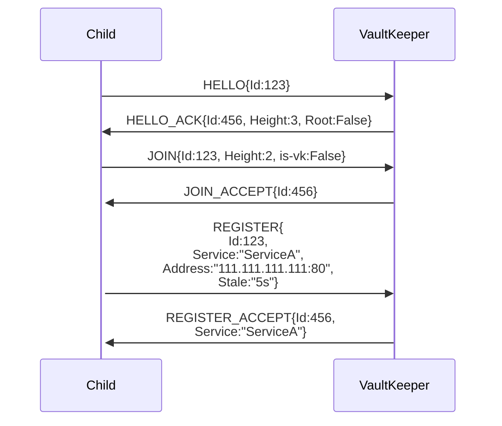
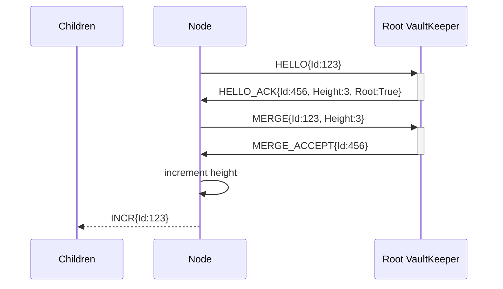
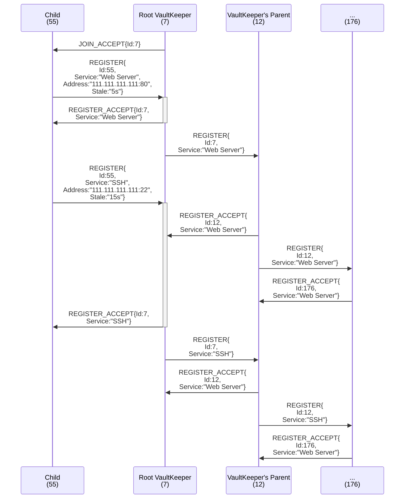

Team: Network-bois

Shrivyas | shrivyas@andrew.cmu.edu

R Landau | rlandau@andrew.cmu.edu <-- the guy writing this README

# Orv: the Decentralized, Hierarchical (Height-Aware), Self-Organizing, Service Discovery Tree

(*OR*ganized *V*aults)

Orv is an algorithm for building self-organizing, decentralized service discovery networks. Nodes join the network as either a leaf or a *vault keeper* (the latter routes messages and supports child nodes, the former does not) and both offer and request services to/from the tree (referred to as the *vault*). If the service is found, the tree returns the address serving it.

Orv does not actually interact with services, it just finds other nodes that purport to provide the service. Services can be any form of resource, from DNS, NAT, tunnel endpoints to files available for download to sensor values like temperature or barometer.

TODO build an example Vault to showcase message flows. Or pull the diagrams from the proposal.

TODO possible two diagrams, one of just the vault in operation and a more advanced one to show all the heartbeats and interaction models as well.

## The Name 

We couldn't land on a name and I needed something to call it. Orv is the lowest layer of the world in the Pathfinder TTRPG, a sprawling network of self-sufficient biomes ("vaults") interconnected by a labyrinth of tunnel.

If we come up with something better, outstanding. If not, life goes on.

### Other names

DSOD (Decentralized, Self-Organizing Discovery)

SOSD (pronounced "sauced") (Self-Organizing Service Discovery)

# Terminology

*Leaf* (better name pending): A single node that can request or provide service, but cannot support children, route messages, or otherwise contribute to the Vault.

*Vault Keeper*: The counterpart to a leaf, a vault keeper is any node that can request or provide services, route messages, and support the growth of the tree by enabling children to join. This can also be a Raft group or similar, replicated collection of machines. As long as it can service Orv requests, it can be a vk.  

*Vault*: A vault is any, complete instance of the algorithm. A single vault keeper with any number of leaves (included 0) is a vault. A tree with 4 layers and hundreds of leaves is a vault. Any tree that supports Orv semantics is a vault.

*Sub-Vault*: Any vault that is a child to another vault. When two vaults join and one ascends to root vault keeper, the other becomes a sub-vault. The sub-vault moniker can be used recursively down a branch.

# Core Design Goals

## Bubble-Up Paradigm

Vaults are designed to only ferry information *up* the tree (with [one, key exception](#the-exception)); a message should never need to walk down a branch. Heartbeats are driven by children; service registrations propagate leaf -> vk -> vk parent -> ... -> vk root; service requests are processed as locally as possible, only walking up the tree if the service is not offered by a lower node, and so on.

The root of the tree is expected to know all services offered by the vault.

> [!TIP]
> Orv is highly flexible and could be tweaked to alter the traffic pattern (for example, by making the root contain less information and allowing some requests to travel down the vault). See Other Designs below for more information.

### The Exception

Precisely one case sends information *down* a branch: [merging](#merging-root-root-joins).

## IoT Support

A major design influence was the desire to support IoT networks effectively. This provides strong boundaries to design within and led to the bubble-up paradigm early.

A multi-level vault will naturally begin to resemble a distributed cloud architecture (mist < fog < cloud), with more data, responsibility, and power being found at the top.


# Core Assumptions

- Nodes are cooperative
    - Like Raft, we are assuming that all peers are cooperative. This causes some cognitive dissonance with it being decentralized, but life goes on.
- Discovery is extrinsic 
    - While we have mechanisms for handling joins, we do not have a mechanism for node discovery, but assume one is available. In a full implementation, this would likely be served by locally broadcasting HELLO.
- Low-powered leaves
    - As we want to support IoT networks, we must assume that the leaves are low-powered and therefore should have minimal requirements. They cannot be assumed to be always listening, always accessible, or even terribly reliable.
- Powered vault keepers
    - To support ultra-low-power leaves, we shift the assumption of power to their parents.
    - This is closely related to the mist < fog < cloud architecture and follows from power requirements rising with a node's height in the tree.
- Built on an existing layer 3
    - IP for the prototype, but MPLS or any other kind of Layer 3 protocol would work fine.
    - This requirement is for the corollary assumption that responses can be independently routed to the requester (and do not necessarily walk the tree on response).
- Unique identifiers
    - We assume each node can determine and utilize a unique identifier. This is a weighty assumption in a decentralized system.
    - If we receive a request from ID X on the opposite end of the tree than we last saw ID X, we assume that node has left its original sub-vault and rejoined a new sub-vault in this same vault.

# Distributed Concepts

- Staleness
- Gossip-based knowledge
- Heartbeats
- Decentralized, dynamic cooperation

# The Protocol

Orv is, fundamentally, a protocol. As long as a machine or language can speak Orv, Orv will work on it.

This section covers Orv's interaction models but if you just want to read about the packet types, take a look at their implementation in the [Go VaultKeeper prototype](pkg/orv/packets.go).

> [!TIP]
> Orv is implemented as a Layer 5 protocol (in the form of HTTP API) in the prototype contained within this repo.
> While some tweaks have been made to support the Client-Server nature of a REST API, it can still be considered a representative Orv implementation.
> You can view the API specs and interact with them directly in your web browser by following the instructions [below](#api-docs).


## Initiating and Joining a Vault

> [!IMPORTANT]
> Nodes only need to join a vault if they wish to aid the tree by offering a service and/or becoming a vault keeper.
> Node who just wish to find services do not need to HELLO or JOIN and can skip right down to [Making Requests](#making-requests-of-a-vault).

Nodes who wish to join the vault must first introduce themselves with `HELLO` messages that includes your unique id. This always returns a `HELLO_ACK` message from a vault keeper. If it does not, something has gone horribly wrong and you will be tried as a [witch](https://media3.giphy.com/media/v1.Y2lkPTc5MGI3NjExYjg2YzRjMXFmbXA1b3Z6dDJzZGZxd3p6eHp2OXpyam9xYWpvM2Q4cCZlcD12MV9pbnRlcm5hbF9naWZfYnlfaWQmY3Q9Zw/enzPQyHVWMfx6/giphy.gif) (or a duck, whichever the crowd prefers).

You must then join the vault via a `JOIN` message that includes your unique id and current height. You will receive a `JOIN_ACCEPT` or a `JOIN_DENY` in response, with the former meaning you have been successfully incorporated as a child of the vault keeper you contacted.

After a receiving a `JOIN_ACCEPT`, the new child node must register a service or they will be pruned and have to re-join. See [Registering A Service](#registering-a-service) below.



### Merging (Root-Root joins)

TODO



#### Dragon's Hoard (Tree-Seeding)

**Not Implemented**

As height adjustments only happen when root-root joins occur, small trees can rapidly accrue a lot of leaves. This increases the possibility of localized, cascading failure for overloaded vks.

If you know that your tree will grow quickly (at least initially), you can start it "with a hoard".
Rather than starting a vault by creating a vk with height 0, start the node with an arbitrary height, thus allowing the vk to subsume other vks without vying for root control.

## Registering a Service

TODO



### Service Expiration

TODO

## Heartbeats

There are two kinds of heartbeats: service heartbeats and vault heartbeats. They are detailed below.

All heartbeats also receive an acknowledgement (HEARTBEAT_ACK) which child nodes can leverage the lack of to consider their parent AWOL.

### Service Heartbeats

Service heartbeats are sent from a leaf to its parent to refresh the staleness of the included services.
Service heartbeats may encapsulate any number of services offered by the leaf (though they will be rejected if a service not registered to the leaf is found; all valid services in the heartbeat message will still be refreshed).

Leaves have the discretion to send one heartbeat for all services or a separate heartbeat for each service or any combination therein.

For example:
- An IoT device probably has a single driver program that handles all "services" (thermistor, barometer, etc) and therefore wants to send a single heartbeat that refreshes the staleness of each.
- A server probably has a number of different programs running independently (DNS, NAT, etc) and wants each to be able to refresh its staleness individually (per interface). If all services from a single leaf had to be updated together, a developer would need to write a helper service to group each existing service (which we should not ask of a developer).

They have the form: HEARTBEAT{Id:123, Services:[ServiceA, ServiceB, ...]}

### Vault Heartbeats

Vault heartbeats are sent from a child VK to its parent to ensure the parent does not prune its branch.

They have the form: VK_HEARTBEAT{Id:123}.


## Status Requests

The only exception to the `HELLO` introduction is `STATUS` messages, which can be issued by anyone, including nodes not part of the vault.

## Making Requests of a Vault

TODO discuss GET and LIST requests

## "Rivering" VaultKeepers

**Not Implemented**

For partition resiliency and load balancing, Orv could support a lateral connection between VKs of the same height. We call this functionality "rivering", as it creates a gossip stream between VKs *of the same height*.
Rivered VKs are VKs that duplicate information across one another. This allows a vault to not splinter completely at the loss of the root and potentially reduces the hotspot that forms around root.

> [!WARNING]
> Only VKs of the same height can be rivered and a VK that merges and therefore increases its height must leave the river.


Rivered VKs do not query each other like children do of their parents; instead, they gossip information back and forth and act as if information from a paired node is always up to date (we cannot allow querying as it could create cycles and count-to-infinite problems). Recurrent heartbeats keep pairs up to date with one another, allowing them to know about services offered by their pairs' children without querying their root.

This function would also allow multiple trees to share services without merging, easing the cost of sending INCRs down a heavily populated branch.

> [!WARNING]
> This idea should be further explored prior to implementation.
> It must not be allowed to create cycles or generate confusion about the route to a service.

# Other Design Decisions

This section details design trade-offs we considered as part of developing Orv. Some sections provide supporting thought for our design patterns while others consider valid, alternative approaches/ways to tweak Orv to suit different needs.

## Layer 5 vs Layer 4 (vs Layer 3?!?)

The prototype is designed as an application layer protocol (in the form of a REST API) because it is easier for us to develop in a short time span. However, the protocol would probably make more sense as a layer 4 built on some kind of reliable UDP (or CoAP, just something less expensive than TCP). Instead of hitting endpoints like /HELLO, /JOIN, etc you send HELLO and JOIN packets. This would also alleviate some of the prickliness of implementing a ...

You could probably even construct this to operate at Layer 3, but then the assumption that the there exists a way to get the response to the requester directly falls apart and would have to be accounted for.

### Sequence Numbers

Orv would likely benefit from sequence numbers. However, coordinating sequence numbers within a node will take some fine-grain efforts as we cannot assume that a single child has a single sequence number. If we did, multiple services on that child would have to coordinate the seqNum, which is unacceptable.

For the prototype, we are omitting seqNums. This is aided by the fact that the prototype uses HTTP over TCP. This assumption would not hold if implemented at Layer 4 or in other network stacks.

## Depth-less Hierarchy and Cycles

The original design allowed for trees of arbitrary height and width, completely self-organizing naturally as machines joined. However, because our routing is only next-hop, this would make cycle detection *really* hard and/or expensive.

Echoing...

## Depth versus Height

A key trade-off is whether we measure a node's depth (its distance from the root) or we measure a node's height (its distance from the lowest vk in the vault).

### Asking to increase the height on vk join

We considered allowing nodes to request that a root increment its height (thus allowing a child of the same former height to join under it).

The current design disallows this due to the cost of echoing an INCR down the tree; we want to avoid additional instances of this expense. However, other implementations of Orv could allow it to make increasing the tree height easier and thus reduce the impact from a stout tree.

#### Lazy Depth/Height Knowledge

Another approach would be to force vks to request up the tree when a vk wants to join it. This would allow the root to approve new height changes and allow vk's lazily learn about their actual height.

## A note on security and PKI

One of our core assumptions is cooperation. This, of course, is not in any way realistic.

A side effect of this protocol is the ability to act as a second source of truth. The vault could be used to pass around public keys, providing a second source of possible "truth" against MitM attacks. These can be self-signed for fully decentralized or rely on a PKI if Orv is used internally or by the controlling interest.


# The Prototype 

(some description of what the prototype is)

The prototype comes with the [VaultKeeper library](pkg/orv/orv.go), an implementation of the same (NYI), and a leaf implementation (NYI).

As noted [above](#layer-5-vs-layer-4-vs-layer-3), the prototype is implemented as a REST API. Not how we envision a production-level implementation, but it is... you know... a prototype. ¯\\_(ツ)_/¯

## Rough Around The Edges

The prototype is missing QoL features and few considerations have been made for efficiency. The bread and butter of the Orv package (the VaultKeeper struct) is not overly configurable and uses coarse-grained locks.
It should be considered a proof of concept and nothing more.

## API Docs

API docs can be accessed by running the server application (currently just `go run main.go`) and then going to [http://localhost:8080/docs](http://localhost:8080/docs) (or whatever address and port your server is bound to). This API documentation is beautifully generated for us by Huma.

## Resources Used

### Libraries

Logging is serviced by [Zerolog](github.com/rs/zerolog).

Our API endpoints are handled by [Huma](https://huma.rocks/).

## Description of project topic, goals, and tasks

### Distributed concepts

- Staleness and gossip-based knowledge
- heartbeats

### Goals

- bubble-up paradigm
    - messages originate from the leaves of the tree and bubble up as necessary
    - heartbeats are child-oriented, allowing children to set their own schedule
- flexible staleness and heartbeats (related to the bubble-up paradigm)

...

## Dependencies to run this code

...

## Description of tests and how to run them

1. Test for...

```
make test
```

# Special Thanks

- Professors Patrick Tague and Pedro Bustamante, for all of your assistance, advice, support, and just general pleasantness to be around
- My cats: Bee (the pretty tortie) and Coconut (the idiot stuck under a drawer), the rubber duck stand-ins
