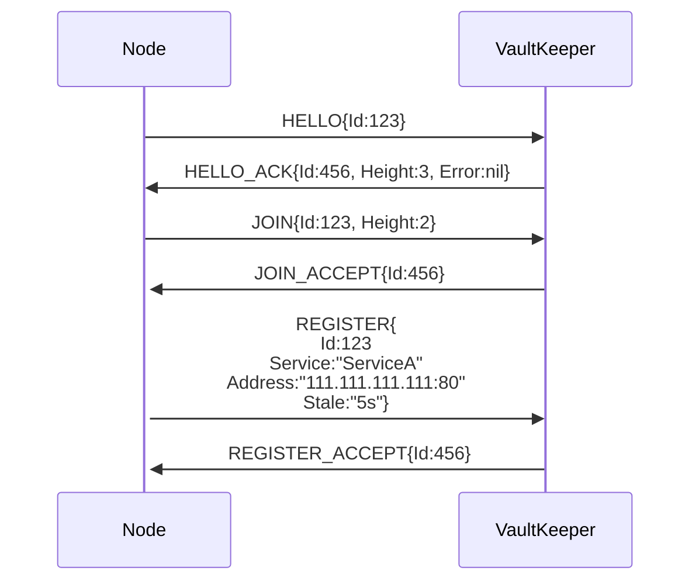

Team: Network-bois

Shrivyas | shrivyas@andrew.cmu.edu

R Landau | rlandau@andrew.cmu.edu <-- the guy writing this README

# Orv: the Decentralized, Hierarchical (Height-Aware), Self-Organizing, Service Discovery Tree

(*OR*ganized *V*aults)

Orv is an algorithm for building self-organizing, decentralized service discovery networks. Nodes join the network as either a leaf or a *vault keeper* (the latter routes messages and supports child nodes, the former does not) and both offer and request services to/from the tree (referred to as the *vault*). If the service is found, the tree returns the address serving it.

Orv does not actually interact with services, it just finds other nodes that purport to provide the service. Services can be any form of resource, from DNS, NAT, tunnel endpoints to files available for download to sensor values like temperature or barometer.

## The Name 

We couldn't land on a name and I needed something to call it. Orv is the lowest layer of the world in the Pathfinder TTRPG, a sprawling network of self-sufficient biomes ("vaults") interconnected by a labyrinth of tunnel.

If we come up with something better, outstanding. If not, life goes on.

### Other names

DSOD (Decentralized, Self-Organizing Discovery)

SOSD (pronounced "sauced") (Self-Organizing Service Discovery)

# Terminology

*Leaf* (better name pending): A single node that can request or provide service, but cannot support children, route messages, or otherwise contribute to the Vault.

*Vault Keeper*: The counterpart to a leaf, a vault keeper is any node that can request or provide services, route messages, and support the growth of the tree by enabling children to join. This can also be a Raft group or similar, replicated collection of machines. As long as it can service Orv requests, it can be a vk.  

*Vault*: A vault is any, complete instance of the algorithm. A single vault keeper with any number of leaves (included 0) is a vault. A tree with 4 layers and hundreds of leaves is a vault. Any tree that supports Orv semantics is a vault.

*Sub-Vault*: Any vault that is a child to another vault. When two vaults join and one ascends to root vault keeper, the other becomes a sub-vault. The sub-vault moniker can be used recursively down a branch.

# Core Design Goals

## IoT Support
The single largest design influence was the desire to support IoT networks effectively. This provides strong boundaries to design within and led to the bubble-up paradigm early.

A multi-level vault will naturally begin to resemble a distributed cloud architecture (mist < fog < cloud), with more data, responsibility, and power being found at the top.

## Bubble-Up Paradigm

Building off the desired support for IoT, a natural "bubble-up" paradigm emerged. Heartbeats are necessarily leaf-driven. Registrations walk leaf -> vk -> vk parent -> ... -> vk root. Requests are localized until they cannot be serviced at which point they "bubble-up" the tree until a vault manager knows where to locate a specific service (or we hit the root and thus know the service does not exist).

# Core Assumptions

- Nodes are cooperative
    - Like Raft, we are assuming that all peers are cooperative. This causes some cognitive dissonance with it being decentralized, but life goes on.
- Discovery is extrinsic 
    - While we have mechanisms for handling joins, we do not have a mechanism for node discovery, but assume one is available. In a full implementation, this would likely be served by locally broadcasting HELLO.
- Low-powered leaves
    - As we want to support IoT networks, we must assume that the leaves are low-powered and therefore should have minimal requirements. They cannot be assumed to be always listening, always accessible, or even terribly reliable.
- Powered vault keepers
    - To support ultra-low-power leaves, we shift the assumption of power to their parents.
    - This is closely related to the mist < fog < cloud architecture and follows from power requirements rising with a node's height in the tree.
- Built on an existing layer 3
    - IP for the prototype, but MPLS or any other kind of Layer 3 protocol would work fine.
    - This requirement is for the corollary assumption that responses can be independently routed to the requester (and do not necessarily walk the tree on response).
- Unique identifiers
    - We assume each node can determine and utilize a unique identifier. This is a weighty assumption in a decentralized system.
    - If we receive a request from ID X on the opposite end of the tree than we last saw ID X, we assume that node has left its original sub-vault and rejoined a new sub-vault in this same vault.

# Distributed Concepts

- Staleness
- Gossip-based knowledge
- Heartbeats
- Decentralized, dynamic cooperation

# The Protocol

## API Specifications

> [!TIP]
> You can view the API specs and interact with them directly in your web browser by following the instructions [below](#api-docs).



### Initiating and Joining a Vault

All new nodes must first introduce themselves with `HELLO` messages that includes your unique id. This always returns a `HELLO_ACK` message from a vault keeper. If it does not, something has gone horribly wrong and you will be tried as a [witch](https://media3.giphy.com/media/v1.Y2lkPTc5MGI3NjExYjg2YzRjMXFmbXA1b3Z6dDJzZGZxd3p6eHp2OXpyam9xYWpvM2Q4cCZlcD12MV9pbnRlcm5hbF9naWZfYnlfaWQmY3Q9Zw/enzPQyHVWMfx6/giphy.gif) (or a duck, whichever the crowd prefers).

You must then join the vault via a `JOIN` message that includes your unique id and current height. You will receive a `JOIN_CONFIRM` or a `JOIN_DENY` in response, with the former meaning you have been successfully incorporated as a child of the vault keeper they contacted. If you receive a `JOIN_DENY`... TODO (this probably needs to enumerate reasons for JOIN_DENY, such as bad height).

#### ROOT-ROOT Joins

TODO

### Heartbeats

TODO

The protocol must be able to handle heartbeats that encapsulate multiple services and heartbeats that come from each services on the same id separately. This must update staleness according only to the services included in each heartbeat.

For example:
- An IoT device probably has a single driver program that handles all "services" (thermistor, barometer, etc) and therefore wants to send a single HB that refreshes the staleness of each.
- A server probably has a number of different programs running independently (DNS, NAT, etc) and wants each to be able to refresh its staleness individually (per interface). If all services from a single leaf/VK had to be updated together, the developer would need to write a service to encapsulate each existing service which is unacceptable.

### Status Requests

The only exception to the `HELLO` introduction is `STATUS` messages, which can be issued by anyone, including nodes not part of the vault.

### Dragon's Hoard (Tree-Seeding)

**Not Implemented**

As height adjustments only happen when root-root joins occur, small trees can rapidly accrue a lot of leaves. This increases the possibility of localized, cascading failure for overloaded vks.

If you know that your tree will grow quickly (at least initially), you can start it "with a hoard".
Rather than starting a vault by creating a vk with height 0, start the node with an arbitrary height, thus allowing the vk to subsume other vks without vying for root control.

# Other Design Decisions

## Layer 5 vs Layer 4 (vs Layer 3?!?)

The prototype is designed as an application layer protocol (in the form of a REST API) because it is easier for us to develop in a short time span. However, the protocol would probably make more sense as a layer 4 built on some kind of reliable UDP (or CoAP, just something less expensive than TCP). Instead of hitting endpoints like /HELLO, /JOIN, etc you send HELLO and JOIN packets.

You could probably even construct this to operate at Layer 3, but then the assumption that the there exists a way to get the response to the requester directly falls apart and would have to be accounted for.

## Depth-less Hierarchy and Cycles

The original design allowed for trees of arbitrary height and width, completely self-organizing naturally as machines joined. However, because our routing is only next-hop, this would make cycle detection *really* hard and/or expensive.

Echoing...

## Depth versus Height

A key trade-off is whether we measure a node's depth (its distance from the root) or we measure a node's height (its distance from the lowest vk in the vault).

### Asking to increase the height on vk join

.

### Lazy Depth/Height Knowledge

Our current design broadcasts height changes down the branch with the root that took over as total root. This is some degree of antithetical to our bubble-up philosophy.

Another approach would be to force vks to request up the tree when a vk wants to join it. This would allow the root to approve new height changes and allow vk's lazily learn about their actual height.

## A note on security

One of our core assumptions is cooperation. This, of course, is not in anyway realistic

... after discovery, key exchange. The vault could be used to pass around public keys, providing a second source of possible "truth" against MitM attacks. These can be self-signed for fully decentralized or rely on a PKI if Orv is used internally or by the controlling interest.

## Sequence Numbers

This protocol needs sequence numbers. However, we cannot assume that a single node has a single sequence number. If we did, multiple services on that node would have to coordinate the seqNum, which is unacceptable.

For now, we are omitting seqNums. This is aided by the fact that the prototype uses HTTP over TCP. This assumption would not hold if implemented at Layer 4 or in other network stacks.

# The Prototype 

(some description of what the prototype is)

The prototype comes with the [VaultKeeper library](pkg/orv/orv.go), an implementation of the same (NYI), and a leaf implementation (NYI).

As noted [above](#layer-5-vs-layer-4-vs-layer-3), the prototype is implemented as a REST API. Not how we envision a production-level implementation, but it is... you know... a prototype. ¯\\_(ツ)_/¯

## Rough Around The Edges

The prototype is missing QoL features that would make it more comfortable to import.

For example, Vault Keepers do not take in the logger you want them to use and, as such, the logger is not terribly configurable. This is illustrative of the slapdash nature of the prototype.

## API Docs

API docs can be accessed by running the server application (currently just `go run main.go`) and then going to [http://localhost:8080/docs](http://localhost:8080/docs) (or whatever address and port your server is bound to). This API documentation is beautifully generated for us by Huma.

## Resources Used

### Libraries

Logging is serviced by [Zerolog](github.com/rs/zerolog).

Our API endpoints are handled by [Huma](https://huma.rocks/).

## Description of project topic, goals, and tasks

### Distributed concepts

- Staleness and gossip-based knowledge
- heartbeats

### Goals

- bubble-up paradigm
    - messages originate from the leaves of the tree and bubble up as necessary
    - heartbeats are child-oriented, allowing children to set their own schedule
- flexible staleness and heartbeats (related to the bubble-up paradigm)

...

## Dependencies to run this code

...

## Description of tests and how to run them

1. Test for...

```
make test
```

# Special Thanks

- Professors Patrick Tague and Pedro Bustamante, for all of your assistance, advice, support, and just general pleasantness to be around
- My cats: Bee (the pretty tortie) and Coconut (the idiot stuck under a drawer), the rubber duck stand-ins
