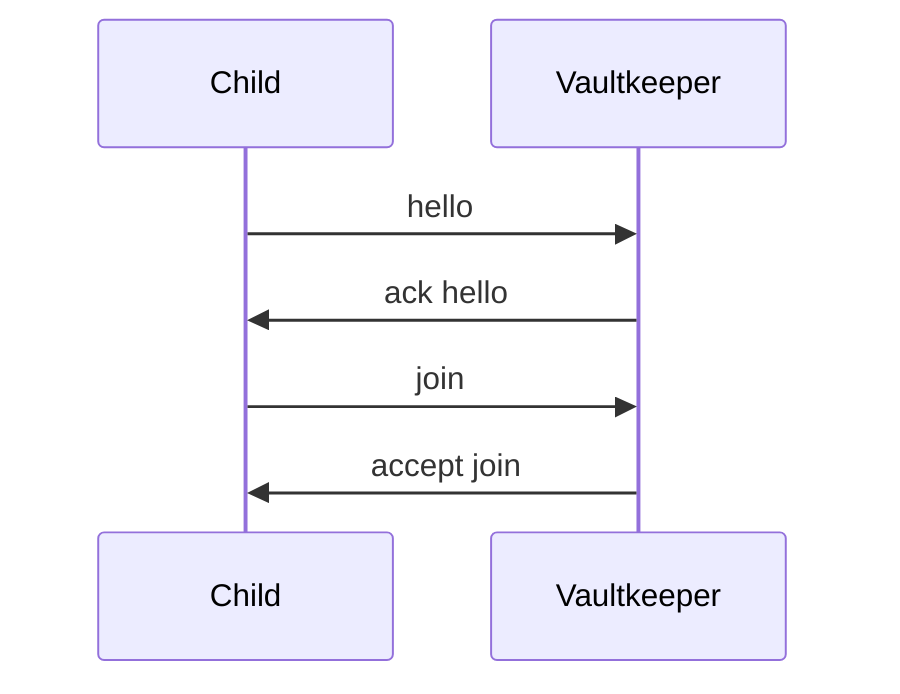
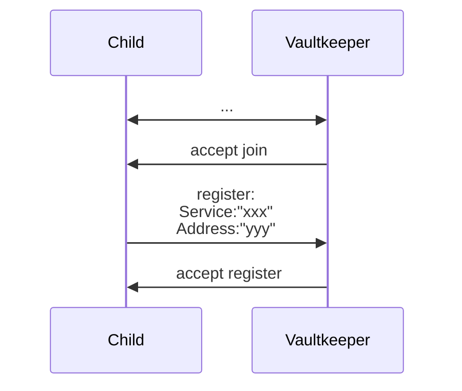
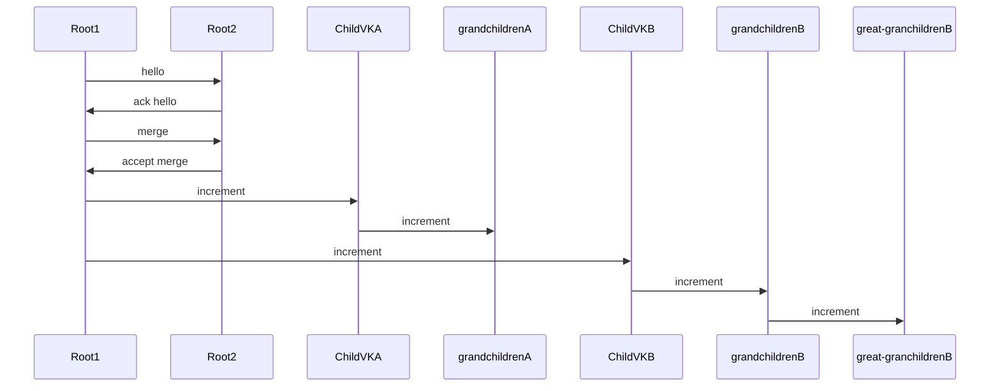
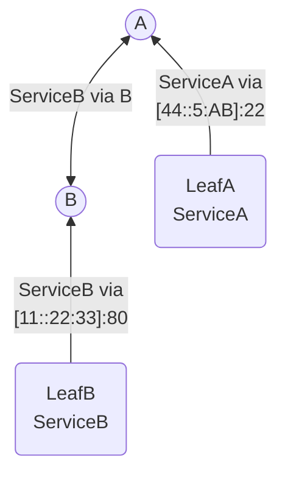

# Decentralized, Hierarchical, Self-Organizing, Service Discovery Trees

Orv is an algorithm for building self-organizing, repairable, decentralized service discovery networks. The general idea is to allow machines to assemble themselves into resilient, fault-tolerant systems so they can request services from one another (and find new providers when an existing one disappears). 

Orv does not actually interact with services, it just finds other nodes that purport to provide the service (by direct string-match). Services can be any form of resource: from DNS, NAT, or tunnel endpoints to downloadable files to sensor values like temperature or barometer.

Nodes join the network as either a leaf or a *Vaultkeeper* (the latter routes messages and supports child nodes, the former does neither) and both offer and request services to/from the tree (referred to as the *vault*). If a provider for the requested service is found, the tree returns the address it can be accessed at.

Here is one example of a vault:

Orv is highly flexible with the above example being just one of a myriad of paradigms.

The name means **O**rganically **R**estructing **V**aults or, if you prefer something recursive, **O**rv **R**uns **V**aults. Or just "Orv". Or, Shrivyas' preferred name: "Izanami". Pick your favorite.

## Authorship

Designed by Shrivyas (shrivyas@andrew.cmu.edu) & [R Landau](https://rflandau.carrd.co/).

We originated, designed, and prototyped Orv (through the [proof variant](implementations/proof)) in two, very long weeks for [Professor Patrick Tague](https://www.cmu.edu/ini/about/team/tague.html)'s Distributed Systems course at Carnegie Mellon University as part of our masters program. The original version is tagged [1.0.1](https://github.com/rflandau/Orv/releases/tag/v1.0.1), if you are interested in the form we turned in for the course.

R (the guy writing this README and the designer of the [slims variant](implementations/slims)) is the current maintainer.

# Terminology

*Orv Variant*: While any design that follows Orv's algorithm can be considered "Orv", there are many tweaks that can be made to better suit Orv to a scenario; these tweaks/decision define a variant. Variants are assumed to **not** be cross-compatible. 

*Orv Implementation*: To further narrow the scope of a variant, an Orv Implementation is a specific library or program built to the spec of an Orv variant. Unlike variants, implementations of the same variant **are** typically assumed to be cross-compatible.

*Leaf*: A single node that provides at least one service, but cannot support children, route messages, or otherwise contribute to the Vault.

*Vaultkeeper*: The counterpart to a leaf, a Vaultkeeper (VK) is any node that can request or provide services, route messages, and support the growth of the vault by enabling children to join. This could be a Raft group or a similar, replicated collection of machines. It could be a single server. It could be a whole data center. As long as it can service Orv requests atomically, it can be a VK.

*Vault*: A vault is any, complete instance of the algorithm as a tree. A single Vaultkeeper with any number of leaves (included 0) is a vault. A tree with 4 layers and hundreds of leaves is a vault. Any tree that supports Orv semantics is a vault.

*Sub-Vault*: Any vault that is a child to another vault (in traditional parlance: a branch). When two vaults join and one ascends to root Vaultkeeper, the other becomes a sub-vault. The "sub-vault" moniker can be used recursively down a branch.

# Using this Repo

This repo contains two variants (Proof and Slims), each with an implementation. Each variant contains a README describing its goal, trade-offs, and how to use the implementation. Each implementation also includes a prototype client, prototype Vaultkeeper, and a Go library that can be imported by other application looking to leverage the variant.

## Proof

[Proof](implementations/proof) was the original prototype and proof of concept for Orv. It is implemented as a REST API. No further work is planned for it.

## Slims

[Slims](implementations/slims) is the second prototype. It is designed as an L5 (application layer) protocol. This variant explores compressing Orv for use in constrained environments as well as some more advanced features Proof did not reach. The implementation contains a library for interfacing directly with these headers. Slims is under active development.

# Core Design

Orv is first-and-foremost an algorithm. It can be tweaked, altered, and played with so that it better suits a particular problem space. This is both a bane and a boon:

1) Two machines speaking two Orv variants likely cannot interoperate due to design differences (let alone implementation differences).

2) As long as a machine or service can speak a specific Orv variant and version, implementations of the variant *should* be interoperable. Orv has no requirements or allegiances to hardware, software, environment, etc.

That being said, there are some key design principles that permeate all variants (even if certain variants stick to them better than others).

## Principle: Bubble-Up Paradigm

Vaults are designed to only ferry information *up* the tree (with [one, key exception](#merging-vaults)); a message should never need to walk down a branch. Heartbeats are driven by children; service registrations propagate leaf -> VK -> VK parent -> ... -> VK root; service requests are processed as locally as possible, only walking up the tree if the service is not offered by a lower node, and so on.

### Root Omnipotence

The root of the tree is expected to know all services offered by the vault.

> [!TIP]
> While the bubble-up paradigm attempts to keep requests as local as possible, root omnipotence can result in a north-south traffic pattern. Orv's traffic pattern can be sculpted via [Rivering](#rivering).

## Principle: Lower Height == Lower Power

The lower you are in a vault, relative to the length of your branch, the lower your assumed availability/capacity/power. This is primarily to support IoT networks: we must assume that the leaves are low-powered and therefore should have minimal requirements. They cannot be assumed to be always listening, always accessible, or even terribly reliable.

This assumption goes both ways: to support ultra-low-power leaves, we shift the assumption of power to their parents. Orv assumes its architecture follows the mist < fog < cloud model.

## Assumption: Cooperative Nodes

Like [Raft](https://raft.github.io/), we are assuming that all peers are cooperative. This causes some cognitive dissonance with it being decentralized, but life goes on.

## Assumption: Extrinsic Discovery

While we have mechanisms for handling joins, we do not have a mechanism for node discovery, but assume one is available.

### Built on an Existing Layer 3

While there is plenty of flexibility to build Orv at different levels, the extrinsic discovery assumption implies the existing of a layer 3 for routing. Orv could be implemented at later 3, but more significant structure changes would be both required and likely beneficial. See [Removing Root Omnipotence](#removing-root-omnipotence-with-vk-hop-tables) below.

### Why

Orv assumes that a mechanism exists for nodes to find each other, but makes no assumptions about the mechanism or the network that services it. This is because neighbour discovery is a problem well-explored in the networking world and solutions are highly dependent on the problem space.

Some examples:

1. An IoT implementation likely finds nodes via physical proximity, broadcasting greetings (ex: ARP) and seeing who in range has a sensitive enough Rx.
2. Intra-net/corporate implementations can likely hijack the neighbour discovery of lower layers or broadcast over the VPS/VPN (a logical broadcast rather than IoT's physical broadcast).
3. A truly decentralized implementation of Orv, think Bittorrent, cannot make any use of broadcasting. In this case, an external provider (like Bittorrent's tracker files) would be necessary for new nodes to discover entry points to their desired vault.

For us to assume anything about this discovery mechanism would be to make assumptions about the use-case of Orv and potentially bloat the protocol.

## Assumption: Unique Identifiers

We assume each node can determine and utilize a unique identifier. This is a weighty assumption in a decentralized system.

# Getting Information Out of a Vault

The primary mechanism for actually *making use of* Orv is the tuple of client requests: Status, Get, and List.

In order to query information (for the sake of finding a service or for learning information about a vault), a client makes one of the following requests against any Vaultkeeper. There is no need to join the vault or otherwise register itself. Any node may make requests, including nodes that are part of the tree!

How requests move around the tree is variant-dependent. See [Client Request Propagation](#client-request-propagation) for details.

>[!IMPORTANT]
> 1) Any machine with access to a Vaultkeeper may make requests of a vault, including those not a part of the vault. Variants may change this to enable rate limiting and/or incentivize assisting the vault, but the basic assumption is that any machine may make requests.
> 2) Requests can be made against any *Vaultkeeper*!

## Status Requests

Status requests do as they it says on the tin: they return the status of the receiving Vaultkeeper.
The specific information returned is implementation-dependent; id, height, and versions are typically the bare minimum.

Whether or not status requests can propagate up the vault (to return information about a different VK than the first hop) is variant-dependent.

## Get Requests

Get requests are the primary mechanism for finding a desired service using Orv.

When a client makes a get request against a VK, that request bubbles up the tree until it reaches a VK that can knows how to access the requested service (or another limited factor occurs such as reaching root without finding the service or exhausting the request's hop limit). An answer is then sent back to the client, containing information on how to reach that service (or that there are no known services that satisfy the request).

## List Request

List requests are non-specific get requests: the VK that answer a list request returns a list of all known services. This can assist clients in identifying services to make get requests for.

# Participating in or Constructing a Vault

For the vault to grow and be useful, nodes must actually join it. As noted [above](#terminology), vaults consist of two kinds of nodes:
- Leaves: nodes that provide information about services they offer.
and
- Vaultkeepers: nodes that route information, answer client requests, and otherwise maintain the vault. Vaultkeepers are also capable of providing information about services in the way leaves do.

## Joining a Vault

> [!TIP]
> A vault can be a single Vaultkeeper, meaning that there is no special procedure for starting a new vault; a node simple declares that it is a VK and thus becomes the root of its vault. 

Both kinds of nodes join the vault in the same way. First, a prospective child must send a hello message to its would-be parent and follow it up with a join request. Assuming this request is accepted, the node may consider itself part of the vault and update its parent information accordingly.

In the join message, the child must indicate whether it is a leaf or a VK; this alters its handling at the parent.

**VKs may only join as child of a VK with a height equal to their's +1.** It should *never* be the case that a child's height is *not* parent's height-1. If two nodes with the same height attempt to join, they should instead consider [merging](#merging-vaults).

## Registering a Service

After joining a vault, the child will typically want to register a service. If the child is a leaf, variants will typically *require* it to register at least once service lest it be pruned out.

A service is registered by its identifier (ex: "RDP") and typically includes the address it can be reached at as well as a "stale time". The stale time enables services to declare their grace period between heartbeats, allowing always-on services and lazy services to coexist in a vault.

Variants *may* allow children to register services in batches, taking an array of pairs instead of a single pair.

## Merging Vaults

When two roots with equal height wish to join, they must instead **merge**. Merging is the key mechanism for increasing vault height and enables the requestor to retain root in the new vault.

Because a failed joined is *not* a pre-requisite for merging, merges require the standard HELLO/HELLO_ACK handshake. 

Once a merge completes, the new root *must* notify all pre-existing children that their height has increased by one. This is typically done by sending an **increment** message to each pre-existing child; these children then propagate the increment to their children and so on until all branches have been fully informed.

## Heartbeating

Heartbeats are the sole mechanism for determining liveliness and always flow *up* a vault.

There are two kinds of heartbeats: VK heartbeats and service heartbeats.

### VK Heartbeats

Vaultkeeper heartbeats are used by child VKs to alert their parent that they are still alive and viable. These must be sent more frequently than a "prune time" defined on the parent. If a heartbeat for a given child is not received with the prune duration, then the parent may prune it from its tables and require the child VK to go through the HELLO-JOIN handshake once more.

When a VK is pruned, it is removed as a provider of each service formerly registered to it. If these services no longer have any providers, they are removed from the parent's tables entirely.

VK heartbeats are considered a replacement for service heartbeats; if a VK is still alive and has not deregistered a service, it is typically safe to assume the service is still alive.

### Service Heartbeats

Service heartbeats are used by leaves to indicate that a service it offers is still alive. Every service listed in the service heartbeat message has its stale timer refreshed.

If a service does not receive a heartbeat within its stated stale time, it is eligible to be pruned.

A leaf with no services registered becomes eligible to be pruned after a short delay.

# Optional Features

## Rivering

Trees are brittle. Vaults are glorified trees. Therefore, vaults are brittle. While this is not a major issue given Orv was designed with lossy networks and consumer-grade hardware in mind, some redundancy is better than no redundancy.
To that end, "rivers" can be created between nodes to duplicate and share information outside of the standard parent-child hierarchy. Rivered VKs exchange heartbeats with one another containing the list of services they offer and how to reach that service. These rivers can serve several purposes, sometimes simultaneously.

1) Load Balancing: rivers between siblings (and between cousins) can save requests from having to hop to parent (or several parents, in the case of cousins). Spatial locality like this reduces the load on higher-level nodes.
2) Resiliency: intra-vault rivers duplicate information to other parts in the tree, enabling requests to continue to be handled even as parent nodes falter. For example, a river between siblings (on top of load balancing) enables them to continue to exchange service information after the death of their parent.
3) Service Breadth: inter-vault rivers increase the scope of services offered without requiring joins or merges. A root-root river maintains the independence of each vault while providing each vault with all the services of the paired vault. However, inter-vault rivers do not improve resiliency and can cause [strange traffic patterns](#river-basins-and-the-fickle-nature-of-gossip).

Unlike the carefully-matched heights in joins and merges, rivers can be formed between almost any two nodes, including nodes in entirely different trees. *The only river that is expressly disallowed is between parent and child*, as this is 1) pointless and 2) prone to cycles. Do note, however, that rivers require hop limits to avoid cycles and can only be guaranteed to be cycle free with a hop limit of 2 or fewer.

### River Basins and The Fickle Nature of Gossip

Rivers between two vaults where at least one peer is not root can cause ["basins"](https://en.wikipedia.org/wiki/Endorheic_basin) to form. The presence of basins can make requests seem fickle, where requests against one branch of a vault will return many services while requests against another branch will turn up very little.

Basins are a by-product of the limitations of rivering. Specifically, basins can form at non-root peers and are due to the rule that gossip cannot travel up the tree like normal service registration does.

Consider the following diagram of two vaults with a gossip stream between the root of vault A and VK BC3:

Requests made against any VK in vault A (given a high enough hop count) will have access to the information learned from VK BC3.
Requests made against VK BC3 will have access to all information in vault A and all information in vault B! Great!
However, requests made against any other VK in vault B will see only the services available in vault B. While this is not negative (clients have guaranteed access to services in vault B, as normal), it could create confusion or the impression of unreliable services given the root is typically considered to be omnipotent about its own vault.

## Blacklisting

Due to services setting their own stale times, it is possible for a client to request a service, receive the address of the service, find the service dead, request again, and receive the same address. To alleviate scenarios like this (or reduce the impact of badly behaving services/providers), variants may allow addresses (or any piece of information available about a service, such as tags or last-heartbeat-time) to be blacklisted in the request.
As it sounds, the tree will ignore services that match the blacklist but otherwise process the request normally.

# Topic Grab Bag

This section contains miscellany. Anything else Shrivyas and I discuss or explored, from consequences of design to heavy modifications to the above logic, goes here.

## Client Request Propagation

As stated above, how client requests move around the tree is variant-dependent. Each method has pros and cons and there are certainly other methods not discussed here.

*For each method below, assume the request is valid; invalid requests would likely be dropped or faulted by the original receiver.*

## Models

### Recursive

When a VK receives a request that it cannot complete, it forwards the request to its parent and awaits a reply. This continues until: the request hits root, a VK *can* service the request, or the request runs out of hops. The response then travels back down the vault until it can be returned to the client.

Proof implements recursive requests.

### Hand-off

When a VK receives a request that it cannot complete, it passes the request to its parent in the same way recursive does. Unlike recursive, however, the VK that passed off the request forgets about the request, only (optionally) awaiting an ACK. When the request find a VK that can answer it (or runs out of VKs to forward to), the final VK responds to the client directly.

Slim implements hand-off requests.

### Iterative

Iterative request handling draws inspiration (id est: shamelessly copies) from iterative DNS querying. When a VK receives a request that it cannot complete, it replies with the address of its parent. The client then asks the parent VK, continuing up the vault until it gets an answer or hits root.

## Comparison

Development-wise, iterative and recursive are the most straightforward. Iterative models place more emphasis on the client, requiring it to query each VK directly. Recursive models requiring each VK to keep the connection open until the request can rubberband back down the vault.

The hand-off approach reduces the strain on VKs, but introduces a number of additional complexities. First, it will be arduous to implement in a client-server paradigm on a connection-oriented protocol like TCP. So probably don't do that; this makes more sense with an L4 Orv. Second, it requires the client spin up a listener to watch for the response packet(s) from *any host*, which brings its own set of challenges. Finally, it requires the introduction of ACK packets for each request type so parent VKs can confirm the hand-off. 

## Sequence Numbers Or Idempotence

In order to support best-effort protocols like UDP (and prevent replay attacks (not that security is currently a focus of Orv's development)), Orv requires a methodology for handing duplicates. Functionally, this means Orv must have a mechanism for sequencing requests (aka sequence numbers) *or* a tolerance for duplicates (aka idempotent message handling).

Slims follows the idempotence technique, enabling it to forgo sequence numbers. Proof also follows this technique, but is less strict (and thus, more prone to undefined behavior at the edge).

How to coordinate sequence number within a node (let alone the full vault) is still an unknown.

If a variant uses exactly-once semantics, this topic is irrelevant. Godspeed.

## Removing Root Omnipotence with VK Hop Tables

Our original design did not include VKs knowing the service addresses of grandchild and lower leaves; they only knew the next hop for a given service.

Take the following diagram as an example:

A knows how to access Service A directly and can respond to requests with LeafA's service address. In our current model, A would also know the address to Service B, so a request that reaches root can respond immediately. Our original design did not support this and, per the diagram, A would need to route a request for Service B down to B, which would know the service's actual address.

This design architecture would increase average hop count, which isn't ideal; possibly encourage an east-west traffic pattern; and possibly distribute the load more evenly in relatively constrained environments. Requests would have to go further on average, but this design could support Orv being implemented at Layer 3, while the current design can only support layer 4 and layer 5. Root would bear less, or at least different, load: VKs could reduce memory usage by grouping services from the same child into that child's entry. Root would still be responsible for forwarding a lot of packets (depending on the balance of the tree), though this could be mitigated by incorporating [Rivered Vaultkeepers](#rivering-vaultkeepers).

## Decrementing Height

Orv has no mechanism for decrementing the height of a VK. Full support for decrementing branches would add another exceptional case (like INCREMENT) which we are trying to avoid and make keeping operations idempotent that much harder.
As VK's know their height *but not their depth* (they know the height they operate at, but do not if there are actually children at each height beyond their immediate children), a VK could not safely decrement because it has no idea if it has children with a height of zero.

Due to only increasing height on merge, Orv *should* (*should* is bearing quite a bit of weight) naturally thin the number of VKs at each height, making hitting the maximum height quite rare.

For very long-running and/or truly decentralized vaults, it may be worthwhile to introduce a mechanism by which VKs can decrement their height. To spitball a solution: if a VK is solo (no children, no parent) for a pre-defined duration, it can reset its height to zero (or the original height of its horde, if given one). When a VK encounters a tree it wishes to join, it will naturally attempt to join at its height (zero). Should it be unable to join at that height (likely because the VKs at height 1 are at their child limits), it may increment its own height and try again. This enables VKs operating autonomously to place themselves within trees without restricting the trees to their with availability at the height the VK previously grew to.

## Depth-less Hierarchy and Cycles

The original design allowed for trees of arbitrary height and width, completely self-organizing naturally as machines joined. However, this makes cycle detection *really* hard to do efficiently. Either nodes must carry a lot more information about their ancestry or we need to echo a message up the tree every time a VK joins and see if it comes back to us (if it does, there is a cycle and the recent join must be dissolved).

There is a valid design in there somewhere, where the restriction of height numbers no longer applies. However, figuring out the optimal way to handle cycles in a project like that (while still supporting as many use-cases as possible) would be a project in its own right.

## Depth Versus Height

A key trade-off was whether we measure a node's depth (its distance from the root) or we measure a node's height (its distance from the lowest VK in the vault). We decided to go with height, as it means that network partitions do not cause broadcast storms. When a parent is lost, its children become disconnect, but their heights do not change and the children's children are wholly unaffected.
Using depth would require nodes to echo down the tree to notify their children of their newly decremented depth.

### Asking To Increase The Height on VK Join

We considered allowing nodes to request that a root increment its height (thus allowing a child of the same former height to join under it).

The current design disallows this due to the cost of echoing an INCREMENT down the tree; we want to avoid additional instances of this expense. However, other implementations of Orv could allow it to make increasing the tree height easier and thus reduce the impact of the stout tree.

#### Lazy Depth/Height Knowledge

Another approach would be to force VKs to request up the tree when a VK wants to join it. This would allow the root to approve new height changes and allow VK's lazily learn about their actual height. This shifts the burden around a bit, potentially increasing the already-likely hotspot on root. However, this method could support depth *or* height and increase the rate at which children learn about changes to their ancestry.

## Multi-hop Gossip

Enabling gossip to propagate through rivers beyond two hops (s.t. gossip from A could reach D via B & C (A <-> B <-> C <-> D)) improves knowledge within the river and thus further increases vault resiliency. However, this does not gel with the fact that node knowledge is spatially limited to a single hop, both in terms of river peers *and* parent/child relations (id est: a VK knows its parent, immediate children, and its river peers, but does not know its grandchildren, grandparent, or the river peers of its peers). Specifically, the issue comes from gossip recirculation: because rivers can have cycles, gossip that hops through the river can return to its source without the source being able to identify that the information was originally its own.

Consider this perfectly valid (multi-hop) river: A <-> B <-> C <-> A.
If gossip can propagate more than two hops, A can reach A. If A offers service X, this information will travel to B, then C, and finally back to A. A will not be able to identify that the source of service X was itself. It can see an identical record, but cannot confirm that it is, in fact, the same record as opposed to a different instance that happens to have the same information. Should service X expire on A, A will remove it from its known services, but continue to propagate the gossip version.

### Potential Solutions

#### Hop Limits

As mentioned in the above section on [rivering](#rivering), the most straightforward solution is to limit hops. If limited to at most 2, we guarantee that no cycles can form.

As long as a hop limit exists, cycles are acceptable; the hop limit guarantees that information *will* be taken out of circulation eventually. The higher the hop limit, the longer stale information can exist in the system (remember: no node beyond the originator can tell if information received via gossip is valid).

#### Source Field

Gossip could include a source field, enabling a node to not unduly propagate its own services.

This comes with substantial limitations, most notably that stale information may continue to propagate forever if the cycle does not include the source.

To similar effect, an implementation could hash the record and use that as a unique identifier as long as the hash includes a timestamp. Hashing just the address will have the same problem noted above (identical addresses but referring to different service instances).

If anything, including source information could be tacked onto hop limits; it cannot stand on its own.

## Processing Differentials in Rivers

Rivering is a parallel system; Vaultkeepers that choose to support it are taking on an additional processing burden. Each pairing creates two new, recurrent heartbeats (one incoming, one outgoing). In a constrained environment, this may be prohibitive. 

Vaultkeepers that choose to gossip should consider the height or service count of their peers as they are likely (but not guaranteed!) to have similar processing capabilities and therefore less likely to overwhelm their peer. For example, rivering two nodes with a height of 1 or 2 is likely safer than rivering a root Vaultkeeper and a height 0 Vaultkeeper.

Do note, however, that gossip heartbeats have the possibility to dramatically increase in packet size (and thus, cycle and memory consumption) at a moment's notice. Without additional guardrails baked into the river peer to prevent a load of services being registered within a short time frame, there is nothing to stabilize the packet size this peer would send to the VK in question.

## Rivers and Height Changes

While the original design of Orv's rivers demanded they be dissolved when a paired node updates its height (likely by [merging](#merging-vaults)), that no longer seems mandatory. It is likely good practice as it will reduce the risks discussed [above](#processing-differentials-in-rivers).

The only real requirement remains that rivers may not form between a parent and its children. As long as this remains false, it is theoretically possibly for rivers to survive merges.

## Service Groups

Though we have yet to explore it thoroughly, vaults could be classed into categories or associated with sets of tags to form groupings. This would facilitate better client-request targeting (to reduce the likelihood of ferrying a client request all the way to root only to return nothing) and simplify segregated scenarios like multi-tenant hosting platforms. Scope-wise, groups could be used at gossip-level to ensure rivers only form between tightly related nodes for better redundancy and robustness (at the cost of breadth) given the cost of rivering or at vault-level to improve vault cohesion.

## Token buckets, request fairness, and supernodes

While not an avenue we explored much, Orv could be tweaked to encourage request servicing by associating nodes to token buckets. Leaves are awarded tokens when one of their services is requested. Tokens are spent when a leaf makes a request, depositing a small fraction of the token at each hop (thereby rewarding VKs for ferrying requests). To discourage nodes from dropping requests, we would likely need parent VKs to be responsible for assigning and revoking the token rewards of its children, which adds another potential "trickle-down" in our "bubble-up" paradigm.

This, of course, hinges on the assumption that nodes can be uniquely identified and reliably authenticated, lest a leecher be able to masquerade as a supernode.

## Version Coordination

As variants grow, they will inevitably be segmented into versions. Versioned, distributed software requires some kind of handshake to ensure all parties speak the same version. While not currently implemented in slims (or proof, of course), version negotiation can piggyback the hello handshake Orv requires and/or take inspiration from OpenFlow's version handshake.

At the very least, VKs will need to include their variant so nodes running different variant can immediately end the interaction.

## A Note On Security

One of our core assumptions is cooperation. This, of course, is wholly unrealistic. Modifying Orv to be resilient to byzantine fault would be another project entirely. As Orv is designed to be decentralized, it has both the boons of decentralization (reliance only on yourself (as a VK) or your parent) and the banes (no sense of global state, easy for bad actors to join and gain power).

# Attribution

The Orv logo was created in [Photopea](https://www.photopea.com/) and uses the vault icon by [juicy_fish on Flaticon](https://www.flaticon.com/free-icons/vault).
