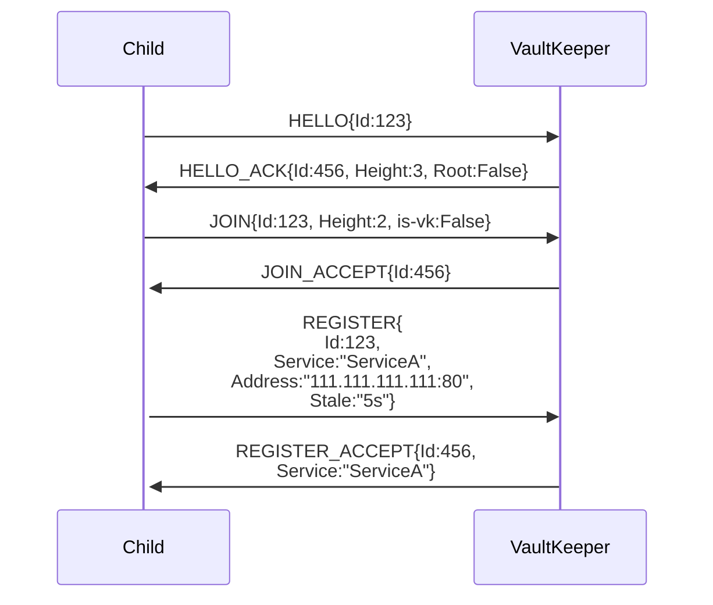
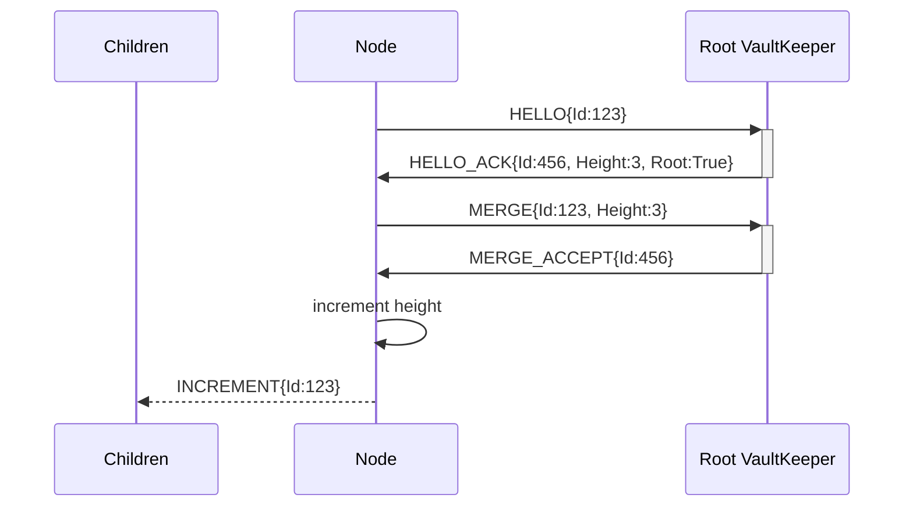
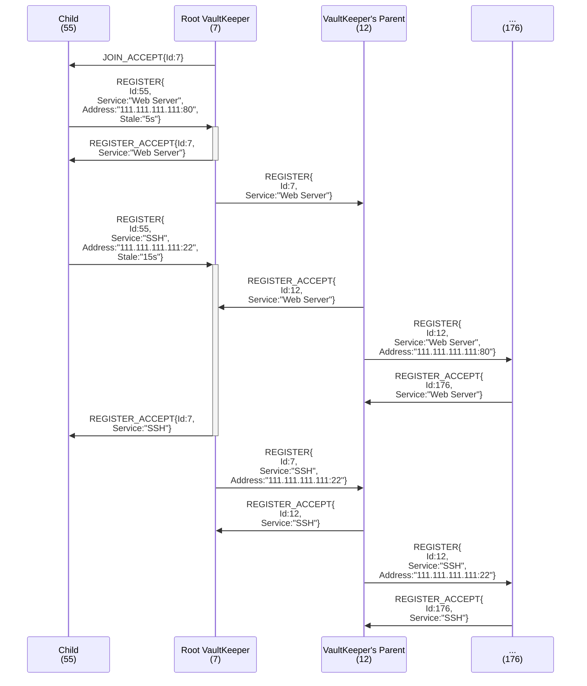
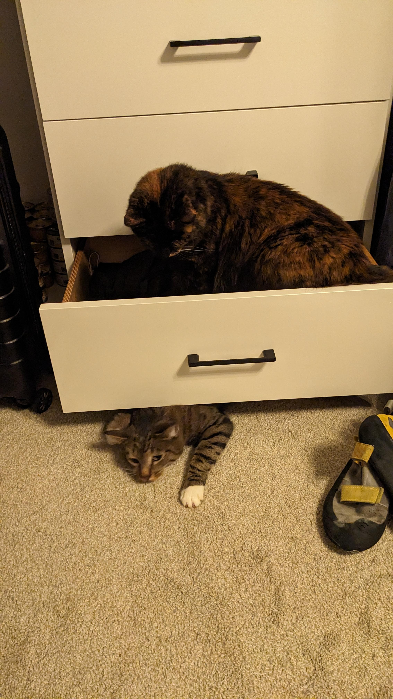

# Orv: the Decentralized, Hierarchical, Self-Organizing, Service Discovery Tree

Orv is an algorithm for building self-organizing, decentralized service discovery networks. Nodes join the network as either a leaf or a *vault keeper* (the latter routes messages and supports child nodes, the former does not) and both offer and request services to/from the tree (referred to as the *vault*). If the service is found, the tree returns the address serving it.

Orv does not actually interact with services, it just finds other nodes that purport to provide the service (by direct string-match). Services can be any form of resource, from DNS, NAT, tunnel endpoints to files available for download to sensor values like temperature or barometer.

## The Name 

Honestly, we never really landed on a name. Orv came about as a temporary solution so I could stop calling it just "The Algorithm".

By the end, we narrowed the name down to Orv (**O**rganically **R**estructing **V**aults or, if you prefer something recursive, **O**rv **R**uns **V**aults) or Izanami. Pick your favorite.

## Authorship

Shrivyas (shrivyas@andrew.cmu.edu) & R Landau (rlandau@andrew.cmu.edu/rflandau@pm.me) <-- the guy writing this README

Shrivyas and I originated, designed, and prototyped Orv in two, very long weeks for Professor Patrick Tague's Distributed Systems course at Carnegie Mellon University as part of our masters program.

# Terminology

*Leaf* (better name pending): A single node that can request or provide service, but cannot support children, route messages, or otherwise contribute to the Vault.

*Vault Keeper*: The counterpart to a leaf, a vault keeper is any node that can request or provide services, route messages, and support the growth of the tree by enabling children to join. This could be a Raft group or a similar, replicated collection of machines. It could be a single server. It could be a whole data center. As long as it can service Orv requests atomically, it can be a vk.

*Vault*: A vault is any, complete instance of the algorithm. A single vault keeper with any number of leaves (included 0) is a vault. A tree with 4 layers and hundreds of leaves is a vault. Any tree that supports Orv semantics is a vault.

*Sub-Vault*: Any vault that is a child to another vault. When two vaults join and one ascends to root vault keeper, the other becomes a sub-vault. The sub-vault moniker can be used recursively down a branch.

# Core Design Goals

## Bubble-Up Paradigm

Vaults are designed to only ferry information *up* the tree (with [one, key exception](#the-exception)); a message should never need to walk down a branch. Heartbeats are driven by children; service registrations propagate leaf -> vk -> vk parent -> ... -> vk root; service requests are processed as locally as possible, only walking up the tree if the service is not offered by a lower node, and so on.

The root of the tree is expected to know all services offered by the vault.

> [!TIP]
> Orv is highly flexible and could be tweaked to alter the traffic pattern (for example, by making the root contain less information and allowing some requests to travel down the vault). See Other Designs below for more information.

### The Exception

Precisely one case sends information *down* a branch: [merging](#merging-root-root-joins).

## IoT Support

A major design influence was the desire to support IoT networks effectively. This provides strong boundaries to design within and led to the bubble-up paradigm early.

A multi-level vault will naturally begin to resemble a distributed cloud architecture (mist < fog < cloud), with more data, responsibility, and power being found at the top.

# Core Assumptions

- Nodes are cooperative
    - Like Raft, we are assuming that all peers are cooperative. This causes some cognitive dissonance with it being decentralized, but life goes on.
- Discovery is extrinsic 
    - While we have mechanisms for handling joins, we do not have a mechanism for node discovery, but assume one is available. See [below](#extrinsic-neighbournode-discovery) for the rationale.
- Low-powered leaves
    - As we want to support IoT networks, we must assume that the leaves are low-powered and therefore should have minimal requirements. They cannot be assumed to be always listening, always accessible, or even terribly reliable.
- Powered vault keepers
    - To support ultra-low-power leaves, we shift the assumption of power to their parents.
    - This is closely related to the mist < fog < cloud architecture and follows from power requirements rising with a node's height in the tree.
- Built on an existing layer 3
    - IP for the prototype, but MPLS or any other kind of Layer 3 protocol would work fine.
    - This requirement is for the corollary assumption that responses can be independently routed to the requester (and do not necessarily walk the tree on response). See [below](#layer-5-vs-layer-4) for a discussion on implementing Orv at different layers of the network stack.
- Unique identifiers
    - We assume each node can determine and utilize a unique identifier. This is a weighty assumption in a decentralized system.
    - If we receive a request from ID X on the opposite end of the tree than we last saw ID X, we assume that node has left its original sub-vault and rejoined a new sub-vault in this same vault.

# Distributed Concepts

Orv as a protocol is based heavily around the idea of redundancy, partial replication of data, dynamic cooperation, and segregation of duties. The prototype relies on numerous timers and a high degree of parallelism. We believe Orv is deeply intertwined with the ideals of a distributed, resilient system because it can operate autonomously and opaquely to the user, masking faults that can be papered over and only propagating faults that cannot be.

- Staleness
- Gossip-based knowledge
- Heartbeats
- Decentralized, dynamic cooperation

# The Protocol

Orv is, fundamentally, a protocol. As long as a machine or language can speak Orv, Orv will work with it.

This section covers Orv's interaction models but if you just want to read about the packet types, take a look at their implementation in the [Go VaultKeeper prototype](pkg/orv/packets.go).

> [!TIP]
> Orv is implemented as a Layer 5 protocol (in the form of HTTP API) in the prototype contained within this repo.
> While some tweaks have been made to support the Client-Server nature of a REST API, it can still be considered a representative Orv implementation.
> You can view the API specs and interact with them directly in your web browser by following the instructions [below](#api-docs).

## Initiating and Joining a Vault

> [!IMPORTANT]
> Nodes only need to join a vault if they wish to aid it by offering a service and/or becoming a vault keeper.
> Node who just wish to find services do not need to HELLO or JOIN and can skip right down to [Making Requests](#making-requests-of-a-vault).

Nodes who wish to join the vault must first introduce themselves with `HELLO` messages that includes their unique id. This always returns a `HELLO_ACK` message from a vault keeper. If it does not, something has gone horribly wrong and you will be turned into a [newt](https://media0.giphy.com/media/v1.Y2lkPTc5MGI3NjExMjA3c3IxZzFpZnBhdzc1aW0xOG1pbjM0ZmZhYnJmYzlrdnVuZXo2NiZlcD12MV9pbnRlcm5hbF9naWZfYnlfaWQmY3Q9Zw/mpxQs0MCqWJKo/giphy.gif).

You must then join the vault via a `JOIN` message that includes your unique id and current height. You will receive a `JOIN_ACCEPT` or a `JOIN_DENY` in response, with the former meaning you have been successfully incorporated as a child of the vault keeper you contacted.

After a receiving a `JOIN_ACCEPT`, the new child node is obligated to register its services. A leaf child *must* register a service or it will be pruned and have to re-join. See [Registering A Service](#registering-a-service) below. A VK child should register its known services as if it was bubbling up a REGISTER; without this the parent may never learn of pre-existing services.

HELLO Form: `HELLO{id:123}`
JOINs have two forms:
- Leaf -> VK: `JOIN{id:123, is-vk:false}`
- VK -> VK: `JOIN{id:123, is-vk:false, height:0, address: "111.111.111.111:9000"}`

### Merging (Root-Root joins)

When two root VKs meet, they can join vaults by performing a MERGE. The VK who requested the merge (sent the original MERGE) packet, becomes the root of the new, conjoined vault. Once a VK receives the MERGE_ACCEPT, it can safely assume that it has acquired root status. It then sends INCREMENT down to its original child VKs (not down the branch of the recently merged VK!), to notify them that that their heights have increased by one step. *This represents the only instance of messages being sent **down** a vault*. 

Without a dragon's hoard (below), MERGEs are the only way for a VK (and thus, a vault) to increase its height.

Form: `MERGE{id:123, height:2}`

#### Dragon's Hoard (Tree-Seeding)

As height adjustments only happen when root-root joins occur, small trees can rapidly accrue a lot of leaves. This increases the possibility of localized, cascading failure for overloaded vks.

If you know that your tree will grow quickly (at least initially), you can start it "with a hoard".
Rather than starting a vault by creating a vk with height 0, start the node with an arbitrary height, thus allowing the vk to subsume other vks without vying for root control.

## Registering a Service

For the vault to actually be useful, it needs to know about which services are available. This is done by nodes (leaves or cVKs) REGISTERing their services. To register a service, the node must a part of the vault and then send a REGISTER packet to its parent. Assuming the registration is accepted, the parent will propagate the REGISTER up the tree.

When registering a service, the provider must provide an address for how to access the service (this register is incidental to Orv, which does no real validation of the service itself; it takes the child node at its word) as well as a "staleness" time for the service. If a parent does not receive a [service heartbeat](#service-heartbeats) for that service within the staleness time, the service will be pruned and must re-register when it comes back online.

It is important to note that only the direct parent cares about staleness; as REGISTERs are propagated up the tree, staleness is dropped (lest every Vk try to heartbeat the same service). When a service fails to heartbeat, the parent will send a DEREGISTER up the tree to notify other VKs not to offer that service any longer.

REGISTERs have two forms:
- Leaf -> VK: `REGISTER{id:123, service:"CA", address:"[FE80::abcd:1234]:8080", stale:"3s"}`
- VK -> VK: `REGISTER{id:123, service:"CA", address:"[FE80::abcd:1234]:8080"}`

### Registering Multiple Services at Once

The spec should *eventually* support registering multiple services in a single REGISTER packet. While not a huge deal for most leaves, which will have service counts in the single or double digits, JOINing/MERGEing large vaults triggers a REGISTER for every service known to the now-child-root and can have hundreds of service providers.

To alleviate the bursty messaging of large-scale join, Orv should support REGISTERs that hold many services to reduce overall message count.

## Heartbeats

There are two kinds of heartbeats: service heartbeats and vault heartbeats. They are detailed below.

All heartbeats also receive an acknowledgement which child nodes can leverage the lack of to consider their parent AWOL.

### Service Heartbeats

Service heartbeats are sent from a leaf to its parent to refresh the staleness of the included services.
Service heartbeats may encapsulate any number of services offered by the leaf; the ACK packet includes a list of services that were refreshed (so a client can determine which services were pruned and thus need to be re-registered).

Leaves have the discretion to send one heartbeat for all services or a separate heartbeat for each service or any combination therein.

For example:
- An IoT device probably has a single driver program that handles all "services" (thermistor, barometer, etc) and therefore wants to send a single heartbeat that refreshes the staleness of each.
- A server probably has a number of different programs running independently (DNS, NAT, etc) and wants each to be able to refresh its staleness individually (per interface). If all services from a single leaf had to be updated together, a developer would need to write a helper service to group each existing service (which we should not ask of a developer).

Form: `SERVICE_HEARTBEAT{id:123, services:[ServiceA, ServiceB, ...]}`

### Vault Heartbeats

Vault heartbeats are sent from a child VK to its parent to ensure the parent does not prune its branch. They are the same basic concept as service heartbeats, but failing to send one in time will cause the parent to drop the child VK and all services registered by it (assuming there are no other providers of the same services on different branches).

Form: `VK_HEARTBEAT{id:123}`.

## Deregistering a Service

A service may disconnect gracefully by sending a DEREGISTER packet to its parent. DEREGISTER packets are also provoked by a service or cVK being pruned due to a lack of heartbeats.

When a VK receives a DEREGISTER, it removes the child as a provider of the specified service. If the VK has no other providers of the service, it propagates the DEREGISTER up the vault.

DEREGISTERs are idempotent and a DEREGISTER for a service not known to be provided by the named child can be safely ignored.

Form: `DEREGISTER{id:123, service:briar}`

## Making Requests of a Vault

Utilizing the service discovery functionality of the vault is done by sending STATUS, GET, or LIST packets to any VK. These are considered "client" interactions and do not require the client to HELLO/JOIN/REGISTER (though nodes within a vault can certainly make requests of the vault, too).

### STATUS Requests

As it says on the tin: STATUS packets ask for the current status of the target VK. What exactly is returned as part of a STATUS_RESPONSE is up to the discretion of the servicing VK.

STATUS requests are not propagated up the tree.

Form: `STATUS{}`

### LIST Requests

LIST packets are used to get the the list of services known to a VK. This will include all services offered by the VK's direct children as well as services that have propagated up the tree via the VK's child VKs.

Form: `LIST{hop-count:3}`.

Hop count limits the maximum height this request can traverse and is decremented on receipt by a VK. Hops are also limited by the height of the tree; if the request hits root, it will return no matter the number of hops remaining. Send a hop count of 1 (or 0, though this should be considered bad practice) to query only your immediate parent.

### GET Requests

GET requests make a request of the vault for a particular service.

The request returns to the client as soon as a VK identifies a provider of the service, returning empty if the request exceeded its hop count or made it all the way too root without finding a provider.

Form: `GET{hop-count:3, service:"DNS"}`.

#### Blacklisting

To prevent clients from routinely being served the same content (for instance, if a service is heartbeating the vault, not is not properly handling clients), GET requests *should* support blacklisting addressing to force the vault to return a different provider, even if it requires going further up the vault.

The included prototype does not support this, but a future version would need to to improve usability.

## "Rivering" VaultKeepers

For partition resiliency and load balancing, Orv could support a lateral connection between VKs of the same height. We call this functionality "rivering", as it creates a gossip stream between VKs *of the same height*.
Rivered VKs are VKs that duplicate information across one another. This allows a vault to not splinter completely at the loss of the root and potentially reduces the hotspot that forms around root.

> [!WARNING]
> Only VKs of the same height can be rivered and a VK that merges and therefore increases its height must leave the river.

Rivered VKs do not query each other like children do of their parents; instead, they gossip information back and forth and act as if information from a paired node is always up to date (we cannot allow querying as it could create cycles and count-to-infinite problems). Recurrent heartbeats keep pairs up to date with one another, allowing them to know about services offered by their pairs' children without querying their root.

This function would also allow multiple trees to share services without merging, easing the cost of sending INCREMENTs down a heavily populated branch.

> [!WARNING]
> This idea should be further explored prior to implementation.
> It must not be allowed to create cycles or generate confusion about the route to a service.

# Other Design Decisions

This section details design trade-offs we considered as part of developing Orv. Some sections provide supporting thought for our design choices; others consider valid, alternative approaches/ways to tweak Orv to suit different needs; and other still discuss functionality that we believe is important, but did not make the initial cut.

## Extrinsic Neighbour/Node Discovery

Orv assumes that a mechanism exists for nodes to find each other, but makes no assumptions about the mechanism or the network that services it. This is because neighbour discovery is a problem well-explored in the networking world and solutions are highly dependent on the problem space.

Some examples:

1. An IoT implementation likely finds nodes via physical proximity, broadcasting greetings (ex: ARP) and seeing who in range has a sensitive enough Rx.
2. Intra-net/corporate implementations can likely hijack the neighbour discovery of lower layers or broadcast over the VPS/VPN (a logical broadcast rather than IoT's physical broadcast).
3. A truly decentralized implementation of Orv, think Bittorrent, cannot make any use of broadcasting. In this case, an external provider (like Bittorrent's tracker files) would be necessary for new nodes to discovery entry points to their desired vault.

For us to assume anything about this discovery mechanism would be to make assumptions about the use-case of Orv and potentially bloat the protocol.

## Layer 5 vs Layer 4

The prototype included in this repo is designed as an application layer implementation (in the form of a REST API) because it is easier for us to develop in a short time span. However, the protocol would probably make more sense as a layer 4 built on some kind of reliable UDP (or CoAP, just something less expensive than TCP). Instead of hitting endpoints like /HELLO, /JOIN, etc you send HELLO and JOIN packets. This would also alleviate some of the prickliness of implementing a iterative messages (such as propagating requests up the vault) in a client-server paradigm.

A layer 3 implementation of Orv would requires some changes to how VKs store information and answer requests; see the option for [VK hop tables](#vk-hop-tables-and-removing-root-omnipotence).

### Sequence Numbers

Orv would likely benefit from sequence numbers. However, coordinating sequence numbers within a node will take some fine-grain efforts as we cannot assume that a single child has a single sequence number. If we did, multiple services on that child would have to coordinate the seqNum, which is unacceptable.

For the prototype, we are omitting seqNums. This is aided by the fact that the prototype uses HTTP over TCP. This assumption would not hold if implemented at Layer 4 or in other network stacks.

### Versioning via HELLOs

To ensure compatibility, HELLOs should be altered to send the highest supported Orv version, allowing nodes to agree on which version to use (a la OpenFlow).

## VK Hop Tables and Removing Root Omnipotence

Our original design did not include VKs knowing the service addresses of grandchild and lower leaves; they only knew the next hop for a given service.

Take the following diagram as an example:

A knows how to access Service A directly and can respond to requests with LeafA's service address. In our current model, A would also know the address to Service B, so a request that reaches root can respond immediately. Our original design did not support this and, per the diagram, A would need to route a request for Service B down to B, which would know the service's actual address.

This design architecture would increase average hop count, which isn't ideal; possibly encourage an east-west traffic pattern; and possibly distribute the load more evenly in relatively constrained environments. Requests would have to go further on average, but this design could support Orv being implemented at Layer 3, while the current design can only support layer 4 and layer 5. Root would bear less, or at least different, load: VKs could reduce memory usage by grouping services from the same child into that child's entry. Root would still be responsible for forwarding a lot of packets (depending on the balance of the tree), though this could be mitigated by incorporating [Rivered VaultKeepers](#rivering-vaultkeepers).

## Recursive Requests or Hand-Off Requests

For the sake of simplicity (on both the client side and the VaultKeeper side), client requests are handled recursively in Orv. When a VK receives a request that it cannot complete (assume all other factors are valid, such as hop count > 2), it passes the request to its parent. This continues until the request hits root, a VK *can* service the request, or the request runs out of hops. The response travels back down the vault until it can be returned to the client.

This is how requests are handled in the included [prototype](#the-prototype).

However, this is not particularly efficient and runs somewhat counter to the bubble-up paradigm. Another idea we discussed was allowing VKs to "hand-off" requests to their parent. When a request (ex: GET) hits a VK and still has more hops it can take (meaning the VK is unable to service the request directly, hop count >2, and the VK != root), the VK passes it to its parent and forgets about it. Once the request has reached its final destination, the final VK responds directly to the client.

The hand-off approach reduces the strain on VKs, but introduces a number of additional complexities. First, it will be arduous to implement in a client-server paradigm on a connection-oriented protocol like TCP. So probably don't do that; this makes more sense with an L4 Orv. Second, it requires the client spin up a listener to watch for LIST_RESPONSE packets from *any host*, which brings its own set of challenges. Finally, it requires the introduction of ACK packets for each request type so parent VKs can confirm the hand-off. 

Here is an example LIST request using the hand-off method: client -|LIST|-> VK, client <-|LIST_ACK|- VK, VK -|LIST|-> parentVK, VK <-|LIST_ACK|- parentVK, ..., VKi -|LIST|-> VKn, VKi <-|LIST_ACK|- VKn, VKn -|LIST_RESPONSE|-> client.

## Depth-less Hierarchy and Cycles

The original design allowed for trees of arbitrary height and width, completely self-organizing naturally as machines joined. However, this makes cycle detection *really* hard to do efficiently. Either nodes must carry a lot more information about their ancestry or we need to echo a message up the tree every time a VK joins and see if it comes back to us (if it does, there is a cycle and the recent join must be dissolved).

There is a valid design in there somewhere, where the restriction of height numbers no longer applies. However, figuring out the optimal way to handle cycles in a project like that (while still supporting as many use-cases as possible) would be a project in its own right.

## Depth Versus Height

A key trade-off was whether we measure a node's depth (its distance from the root) or we measure a node's height (its distance from the lowest vk in the vault). We decided to go with height, as it means that network partitions do not cause broadcast storms. When a parent is lost, its children become disconnect, but their heights do not change and the children's children are wholly unaffected.
Using depth would require nodes to echo down the tree to notify their children of their newly decremented depth.

### Asking To Increase The Height on VK Join

We considered allowing nodes to request that a root increment its height (thus allowing a child of the same former height to join under it).

The current design disallows this due to the cost of echoing an INCREMENT down the tree; we want to avoid additional instances of this expense. However, other implementations of Orv could allow it to make increasing the tree height easier and thus reduce the impact of the stout tree.

#### Lazy Depth/Height Knowledge

Another approach would be to force vks to request up the tree when a vk wants to join it. This would allow the root to approve new height changes and allow vk's lazily learn about their actual height. This shifts the burden around a bit, potentially increasing the already-likely hotspot on root. However, this method could support depth *or* height and increase the rate at which children learn about changes to their ancestry.

## Token buckets, request fairness, and supernodes

While not an avenue we explored much, Orv could be tweaked to encourage request servicing by associating nodes to token buckets. Leaves are awarded tokens when one of their services is requested. Tokens are spent when a leaf makes a request, depositing a small fraction of the token at each hop (thereby rewarding VKs for ferrying requests). To discourage nodes from dropping requests, we would likely need parent VKs to be responsible for assigning and revoking the token rewards of its children, which adds another potential "trickle-down" in our "bubble-up" paradigm.

This, of course, hinges on the assumption that nodes can be uniquely identified and reliably authenticated, lest a leecher be able to masquerade as a supernode.

## A Note On Security

One of our core assumptions is cooperation. This, of course, is wholly unrealistic. Modifying Orv to be resilient to byzantine fault would be another project entirely. As Orv is designed to be decentralized, it has both the boons of decentralization (reliance only on yourself (as a VK) or your parent) and the banes (no sense of global state, easy for bad actors to join and gain power).

## PKI Use-Case

A more unique use-case we wanted to draw attention to is the ability of Orv to act as a second source of truth for public key distribution. Orv could be tweaked to pass around public keys, providing a second source of possible "truth" against MitM attacks. When a service joins, it provides its public key. This public key is distributed around the vault in the same way the service registration propagates. When a client requests a service, the service's public key is provided as well. Clients could query multiple nodes to check that they are providing the same public key.

When the client initiates contact with the fetched service, it now validate that the public key the service provides matches the public keys provided by Orv. These keys can be self-signed for fully decentralized or rely on a PKI if Orv is used internally or by the controlling interest.

# The Prototype 

To test and showcase the protocol, this repo comes with a [VaultKeeper library](pkg/orv/orv.go), an implementation of the [same](vk/main.go), a [leaf implementation](leaf/main.py), and simple implementations of [client requests](pkg/orv/requests.go).

As noted [above](#layer-5-vs-layer-4-vs-layer-3), the prototypes included herein are implemented via a REST API. Not how we envision a production-level implementation, but it is... you know... a prototype. ¯\\_(ツ)_/¯

## The VaultKeeper Library

The meat of the prototype is the `orv` package and its VaultKeeper struct. This struct is a multithreaded, self-managing implementation of a VK. It contains the aforementioned HTTP server for processing packets, [packets.go](pkg/orv/packets.go) for declaring and describing packet types, a series of [tests](pkg/orv/orv_test.go) to ensure it meets the basic spec, and an internal [service](pkg/orv/children.go) for managing the VK's children.

From a design standpoint, the VK class is not insignificant. While performance was not our goal, a protocol of this kind requires at least a baseline level of parallelism. As such, the class is a strange amalgamation of mutexes, self-destructing data (driven by `*time.Timers`), a pruner service for cleaning up what cannot self-destruct, and a heartbeater service so a VK can automatically track its parent. VKs are spun up via `NewVaultKeeper()` and can be driven in code by the exported subroutines. After `.Start()` is called, the VK's HTTP server is available for processing requests from external entities. Remember to kill the VK with `.Terminate()` when you are done.

> [!WARNING]
> The VK prototype is missing QoL features and few considerations have been made for efficiency. The bread and butter of the Orv package (the VaultKeeper struct) is not overly configurable and uses coarse-grained locks.
> It should be considered a proof of concept and *nothing more*.

### API Docs

API docs can be accessed by running the server application (currently just `go run vk/main.go`) and then going to [http://localhost:8080/docs](http://localhost:8080/docs) (or whatever address and port your server is bound to). This API documentation is beautifully generated for us by Huma.

### Notable Omissions

As mentioned above, the prototype is just that: *a prototype*. The VaultKeeper proves Orv's viability, but no more. As such, some features are missing.

- VaultKeeper-Local Services: The library does not support services local to a VK. Part of Orv's intention is allow services to register directly with a VKs on the same host so the VK becomes responsible for its heartbeats. Without this functionality, services must be registered under leaves.
- [Root-Root Merging](#merging-root-root-joins): The VaultKeeper library does not include handling for the MERGE packet (and has no /merge endpoint to accept them). This means that vaults of equal height cannot join and vaults cannot increase their height after creation. As INCREMENTEMENT packets are only triggered by MERGE, they have also been omitted. We grant that this is a substantial feature to be wholly absent, but believe that the prototype proves Orv's viability nonetheless.
- [Rivering](#rivering-vaultkeepers): Allowing VKs to pair laterally was a late-stage design decision and thus did not make the cut for inclusion in the prototype. We also believe that rivering is a 'nice-to-have' and not critical to the usefulness of Orv.
- [Blacklisting](#blacklisting): While allowing clients to blacklist providers was always a part of Orv's design, client requests operate just fine without it. Thus we omitted it from the prototype so we could focus on more critical aspects.
- [Deregistering](#deregistering-a-service): The VaultKeeper library does not support DEREGISTER packets and services can only be un-learned by being pruned (due to a lack of heartbeats).

## The VaultKeeper Implementation

The implementation in [vk/main.go](vk/main.go) is really just an invocation of the library and showcases how simple it is for users to incorporate Orv into their existing Go code.

## The Leaf Implementation

To show that Orv is language agnostic, Shrivyas wrote up a [simple Python script](leaf/main.py) that connects to a VK as a leaf and registers a single service. Again, as long as a device or program can speak Orv, it can join a vault.

## Request Functions

The Orv package includes functions in `requests.go` to perform requests on your behalf. These are requests that can be run without joining the vault and are intended to be directly incorporated into user libraries.

## Making and Running The Prototype

Being a Go project, it should manage all of its own dependencies.

Each test contains a comment describing what it is testing and how, available in [orv_test.go](pkg/orv/orv_test.go).

To build the example VaultKeeper, use `make build`.

To run the testing code, use `make test` or `make test-race` (the latter tests with Go's race condition checker enabled).

## Resources Used

### Libraries

Logging is serviced by [Zerolog](github.com/rs/zerolog).

Our API endpoints are handled by [Huma](https://huma.rocks/). *NOTE:* We ran into some issues with humatest and are not relying it for the testing infrastructure.

Requests (both within a VK and from the client side) as well as API requests made in tests are built on top of [Resty](https://resty.dev/).

# Special Thanks

- Professors Patrick Tague and Pedro Bustamante, for all of your assistance, advice, support, and just general pleasantness to be around.
- My cats: Bee (the pretty tortie) and Coconut (the idiot stuck under a drawer), the rubber duck stand-ins

