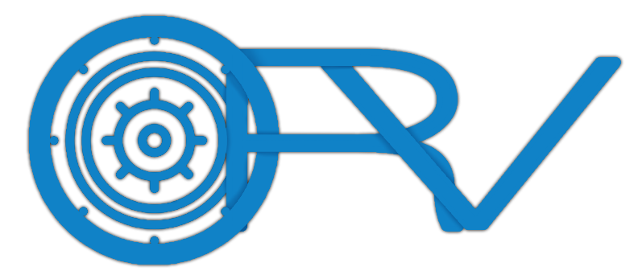

# Decentralized, Hierarchical, Self-Organizing, Service Discovery Trees

Orv is an algorithm for building self-organizing, decentralized service discovery networks. The general idea is to allow machines to assemble themselves into resilient, fault-tolerant networks so they can request services from one another (and find new providers when an existing one disappears). 

Orv does not actually interact with services, it just finds other nodes that purport to provide the service (by direct string-match). Services can be any form of resource, from DNS, NAT, or tunnel endpoints to files available for download to sensor values like temperature or barometer.

Nodes join the network as either a leaf or a *vault keeper* (the latter routes messages and supports child nodes, the former does neither) and both offer and request services to/from the tree (referred to as the *vault*). If a provider for the requested service is found, the tree returns the address it can be accessed at.

Here is one example of a vault:

Orv is highly flexible with the above example being just one of a myriad of paradigms.

## Authorship

Designed by Shrivyas (shrivyas@andrew.cmu.edu) & R Landau (rlandau@andrew.cmu.edu/rflandau@pm.me).

We originated, designed, and prototyped Orv (through the [proof variant](implementations/proof)) in two, very long weeks for Professor Patrick Tague's Distributed Systems course at Carnegie Mellon University as part of our masters program. The original version is tagged [1.0.1 @ commit 74c4d4f5c94b14d803c39590982b778e57ae7a96](https://github.com/rflandau/Orv/releases/tag/v1.0.1), if you are interested in the form we turned in for the course.

R (the guy writing this README and the designer of the [slims variant](implementations/slims)) is the current maintainer.

# Terminology

*Orv Variant*: An Orv variant is defined by the set of design decisions. While any design that follows Orv's algorithm can be considered "Orv", there are many tweaks that can be made to better suit Orv to a scenario; these tweaks/decision define a variant. Variants are assumed to **not** be cross-compatible. 

*Orv Implementation*: To further narrow the scope of a variant, an Orv Implementation is a specific library or program built to the spec of an Orv variant. Unlike variants, implementations of the same variant are typically expected to be cross-compatible.

*Leaf*: A single node that can request or provide service, but cannot support children, route messages, or otherwise contribute to the Vault.

*Vault Keeper*: The counterpart to a leaf, a vault keeper is any node that can request or provide services, route messages, and support the growth of the tree by enabling children to join. This could be a Raft group or a similar, replicated collection of machines. It could be a single server. It could be a whole data center. As long as it can service Orv requests atomically, it can be a vk.

*Vault*: A vault is any, complete instance of the algorithm. A single vault keeper with any number of leaves (included 0) is a vault. A tree with 4 layers and hundreds of leaves is a vault. Any tree that supports Orv semantics is a vault.

*Sub-Vault*: Any vault that is a child to another vault. When two vaults join and one ascends to root vault keeper, the other becomes a sub-vault. The sub-vault moniker can be used recursively down a branch.

# Using this Repo

This repo contains two variants (Proof and Slims), each with an implementation. Each variant contains a README describing its goal, trade-offs, and how to use its implementation. Each implementation also includes a prototype client, prototype vault keeper, and a Go library that can be imported by other application looking to leverage the variant.

## Proof

[Proof](implementations/proof) is the very first prototype of Orv. It is implemented as a REST API and serves as a proof of concept more than anything else. No further work is planned for it.

## Slims

[Slims](implementations/slims) is the second prototype. It is designed as an L5 (application layer) protocol. This variant explores compressing Orv for use in highly constrained environments, going so far as to design its own L5 header. The implementation contains a library for interfacing directly with these headers. Slims is under active development.

# Core Design

Orv is first-and-foremost an algorithm. It can be tweaked, altered, and played with so that it better suits a particular problem space. This is both a bane and a boon:

1) Two machines speaking two Orv variants likely cannot interoperate due to design differences (let along implementation differences).

2) As long as a machine or language can speak a specific Orv variant and version, implementations of the variant *should*be able to interoperate. Orv has no requirements or allegiances to hardware, software, environment, etc.

That being said, there are some key design principles that permeate all variants (even if certain designs stick to them better than others).

## Principle: Bubble-Up Paradigm

Vaults are designed to only ferry information *up* the tree (with [one, key exception](#the-exception)); a message should never need to walk down a branch. Heartbeats are driven by children; service registrations propagate leaf -> vk -> vk parent -> ... -> vk root; service requests are processed as locally as possible, only walking up the tree if the service is not offered by a lower node, and so on.

### Root Omnipotence

The root of the tree is expected to know all services offered by the vault.

> [!TIP]
> While the bubble-up paradigm attempts to keep requests as local as possible, root omnipotence can result in a north-south traffic pattern. Orv's traffic pattern can be sculpted to a more east-west pattern via Rivering. 

TODO link rivering

## Principle: Lower Height == Lower Power

The lower you are in a vault, relative to the length of your branch, the lower your assumed availability/capacity/power. This is primarily to support IoT networks: we must assume that the leaves are low-powered and therefore should have minimal requirements. They cannot be assumed to be always listening, always accessible, or even terribly reliable.

This assumption goes both ways: to support ultra-low-power leaves, we shift the assumption of power to their parents. Orv assumes its architecture follows the mist < fog < cloud model.

## Assumption: Cooperative Nodes

Like [Raft](https://raft.github.io/), we are assuming that all peers are cooperative. This causes some cognitive dissonance with it being decentralized, but life goes on.

## Assumption: Extrinsic Discovery

While we have mechanisms for handling joins, we do not have a mechanism for node discovery, but assume one is available.

### Built on an Existing Layer 3

While there is plenty of flexibility to build Orv at different levels, the extrinsic discovery assumption implies the existing of a layer 3 for routing. Orv could be implemented at later 3, but more significant structure changes would be both required and likely beneficial. See X below. TODO

### Why

Orv assumes that a mechanism exists for nodes to find each other, but makes no assumptions about the mechanism or the network that services it. This is because neighbour discovery is a problem well-explored in the networking world and solutions are highly dependent on the problem space.

Some examples:

1. An IoT implementation likely finds nodes via physical proximity, broadcasting greetings (ex: ARP) and seeing who in range has a sensitive enough Rx.
2. Intra-net/corporate implementations can likely hijack the neighbour discovery of lower layers or broadcast over the VPS/VPN (a logical broadcast rather than IoT's physical broadcast).
3. A truly decentralized implementation of Orv, think Bittorrent, cannot make any use of broadcasting. In this case, an external provider (like Bittorrent's tracker files) would be necessary for new nodes to discover entry points to their desired vault.

For us to assume anything about this discovery mechanism would be to make assumptions about the use-case of Orv and potentially bloat the protocol.

## Assumption: Unique Identifiers

We assume each node can determine and utilize a unique identifier. This is a weighty assumption in a decentralized system.

If we receive a request from ID X on the opposite end of the tree than we last saw ID X, we assume that node has left its original sub-vault and rejoined a new sub-vault in this same vault.

# Interaction Model

## Initiating and Joining a Vault

## TODO (with suggested packet)

# Tweaking Orv

## Sequence Numbers Or Idempotence

To reduce ...

## Removing Root Omnipotence

# Other Design Decisions and Tradeoffs

## Decrementing Height

Orv has no mechanism for decrementing the height of a vk. Full support for decrementing branches would add another exceptional case (like INCREMENT) which we are trying to avoid and make keeping operations idempotent that much harder.
As vk's know their height *but not their depth* (they know the height they operate at, but do not if there are actually children at each height beyond their immediate children), a vk could not safely decrement because it has no idea if it has children with a height of zero.

Due to only increasing height on merge, Orv *should* (*should* is bearing quite a bit of weight) naturally thin the number of vks at each height, making hitting the maximum height quite rare.

For very long-running and/or truly decentralized vaults, it may be worthwhile to introduce a mechanism by which vks can decrement their height. To spitball a solution: if a vk is solo (no children, no parent) for a pre-defined duration, it can reset its height to zero (or the original height of its horde, if given one). When a vk encounters a tree it wishes to join, it will naturally attempt to join at its height (zero). Should it be unable to join at that height (likely because the VKs at height 1 are at their child limits), it may increment its own height and try again. This enables vks operating autonomously to place themselves within trees without restricting the trees to their with availability at the height the vk previously grew to.

## Depth-less Hierarchy and Cycles

The original design allowed for trees of arbitrary height and width, completely self-organizing naturally as machines joined. However, this makes cycle detection *really* hard to do efficiently. Either nodes must carry a lot more information about their ancestry or we need to echo a message up the tree every time a VK joins and see if it comes back to us (if it does, there is a cycle and the recent join must be dissolved).

There is a valid design in there somewhere, where the restriction of height numbers no longer applies. However, figuring out the optimal way to handle cycles in a project like that (while still supporting as many use-cases as possible) would be a project in its own right.

## Depth Versus Height

A key trade-off was whether we measure a node's depth (its distance from the root) or we measure a node's height (its distance from the lowest vk in the vault). We decided to go with height, as it means that network partitions do not cause broadcast storms. When a parent is lost, its children become disconnect, but their heights do not change and the children's children are wholly unaffected.
Using depth would require nodes to echo down the tree to notify their children of their newly decremented depth.

### Asking To Increase The Height on VK Join

We considered allowing nodes to request that a root increment its height (thus allowing a child of the same former height to join under it).

The current design disallows this due to the cost of echoing an INCREMENT down the tree; we want to avoid additional instances of this expense. However, other implementations of Orv could allow it to make increasing the tree height easier and thus reduce the impact of the stout tree.

#### Lazy Depth/Height Knowledge

Another approach would be to force vks to request up the tree when a vk wants to join it. This would allow the root to approve new height changes and allow vk's lazily learn about their actual height. This shifts the burden around a bit, potentially increasing the already-likely hotspot on root. However, this method could support depth *or* height and increase the rate at which children learn about changes to their ancestry.

## Token buckets, request fairness, and supernodes

While not an avenue we explored much, Orv could be tweaked to encourage request servicing by associating nodes to token buckets. Leaves are awarded tokens when one of their services is requested. Tokens are spent when a leaf makes a request, depositing a small fraction of the token at each hop (thereby rewarding VKs for ferrying requests). To discourage nodes from dropping requests, we would likely need parent VKs to be responsible for assigning and revoking the token rewards of its children, which adds another potential "trickle-down" in our "bubble-up" paradigm.

This, of course, hinges on the assumption that nodes can be uniquely identified and reliably authenticated, lest a leecher be able to masquerade as a supernode.

## A Note On Security

One of our core assumptions is cooperation. This, of course, is wholly unrealistic. Modifying Orv to be resilient to byzantine fault would be another project entirely. As Orv is designed to be decentralized, it has both the boons of decentralization (reliance only on yourself (as a VK) or your parent) and the banes (no sense of global state, easy for bad actors to join and gain power).
