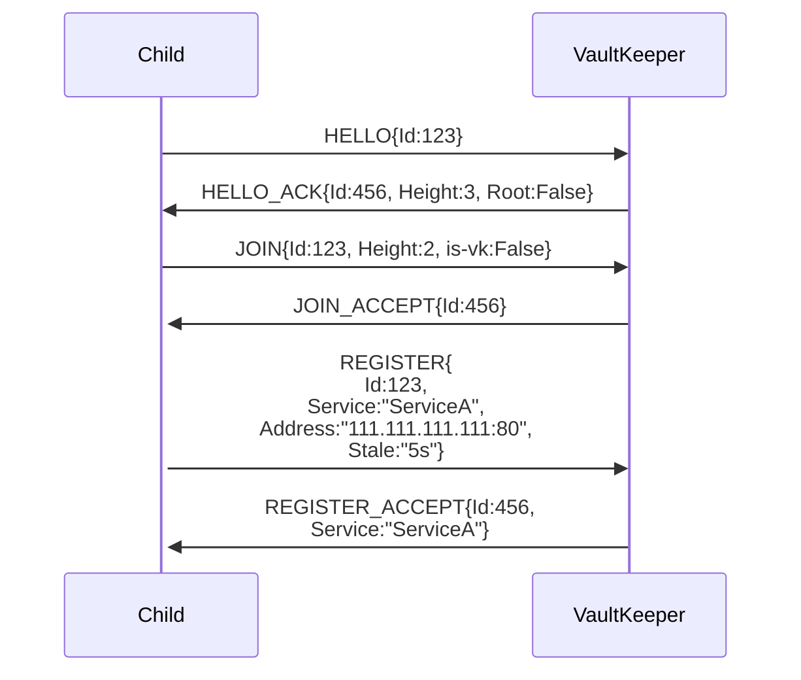
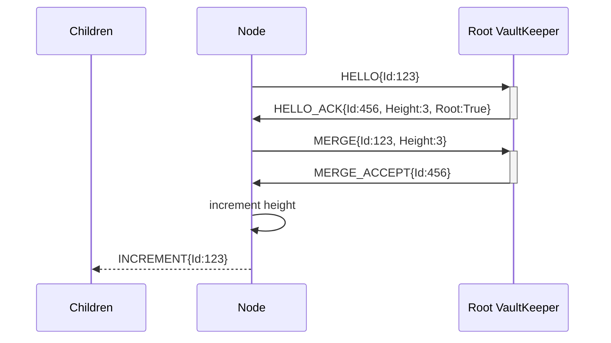
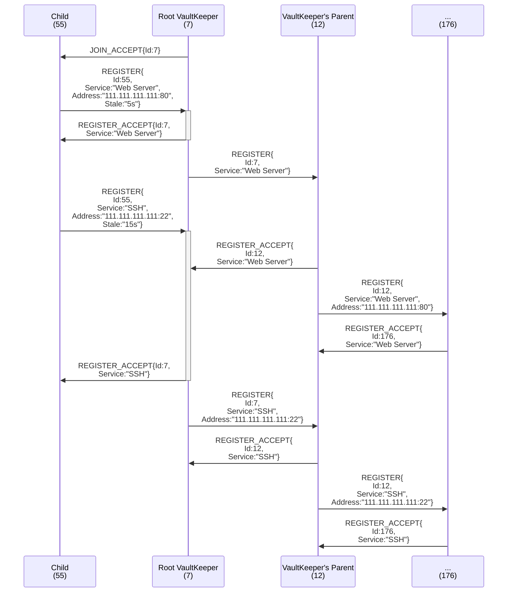

# The Prototype 

To test and showcase the protocol, this repo comes with a [VaultKeeper library](pkg/orv/orv.go), an implementation of the [same](vk/main.go), a [leaf implementation](leaf/main.py), and simple implementations of [client requests](pkg/orv/requests.go).

As noted [above](#layer-5-vs-layer-4-vs-layer-3), the prototypes included herein are implemented via a REST API. Not how we envision a production-level implementation, but it is... you know... a prototype. ¯\\_(ツ)_/¯

## The VaultKeeper Library

The meat of the prototype is the `orv` package and its VaultKeeper struct. This struct is a multithreaded, self-managing implementation of a VK. It contains the aforementioned HTTP server for processing packets, [packets.go](pkg/orv/packets.go) for declaring and describing packet types, a series of [tests](pkg/orv/orv_test.go) to ensure it meets the basic spec, and an internal [service](pkg/orv/children.go) for managing the VK's children.

From a design standpoint, the VK class is not insignificant. While performance was not our goal, a protocol of this kind requires at least a baseline level of parallelism. As such, the class is a strange amalgamation of mutexes, self-destructing data (driven by `*time.Timers`), a pruner service for cleaning up what cannot self-destruct, and a heartbeater service so a VK can automatically track its parent. VKs are spun up via `NewVaultKeeper()` and can be driven in code by the exported subroutines. After `.Start()` is called, the VK's HTTP server is available for processing requests from external entities. Remember to kill the VK with `.Terminate()` when you are done.

> [!WARNING]
> The VK prototype is missing QoL features and few considerations have been made for efficiency. The bread and butter of the Orv package (the VaultKeeper struct) is not overly configurable and uses coarse-grained locks.
> It should be considered a proof of concept and *nothing more*.

### API Docs

API docs can be accessed by running the server application (currently just `go run vk/main.go`) and then going to [http://localhost:8080/docs](http://localhost:8080/docs) (or whatever address and port your server is bound to). This API documentation is beautifully generated for us by Huma.

### Notable Omissions

As mentioned above, the prototype is just that: *a prototype*. The VaultKeeper proves Orv's viability, but no more. As such, some features are missing.

- VaultKeeper-Local Services: The library does not support services local to a VK. Part of Orv's intention is allow services to register directly with a VKs on the same host so the VK becomes responsible for its heartbeats. Without this functionality, services must be registered under leaves.
- [Root-Root Merging](#merging-root-root-joins): The VaultKeeper library does not include handling for the MERGE packet (and has no /merge endpoint to accept them). This means that vaults of equal height cannot join and vaults cannot increase their height after creation. As INCREMENTEMENT packets are only triggered by MERGE, they have also been omitted. We grant that this is a substantial feature to be wholly absent, but believe that the prototype proves Orv's viability nonetheless.
- [Rivering](#rivering-vaultkeepers): Allowing VKs to pair laterally was a late-stage design decision and thus did not make the cut for inclusion in the prototype. We also believe that rivering is a 'nice-to-have' and not critical to the usefulness of Orv.
- [Blacklisting](#blacklisting): While allowing clients to blacklist providers was always a part of Orv's design, client requests operate just fine without it. Thus we omitted it from the prototype so we could focus on more critical aspects.
- [Deregistering](#deregistering-a-service): The VaultKeeper library does not support DEREGISTER packets and services can only be un-learned by being pruned (due to a lack of heartbeats).

## The VaultKeeper Implementation

The implementation in [vk/main.go](vk/main.go) is really just an invocation of the library and showcases how simple it is for users to incorporate Orv into their existing Go code.

## The Leaf Implementation

To show that Orv is language agnostic, Shrivyas wrote up a [simple Python script](leaf/main.py) that connects to a VK as a leaf and registers a single service. Again, as long as a device or program can speak Orv, it can join a vault.

## Request Functions

The Orv package includes functions in `requests.go` to perform requests on your behalf. These are requests that can be run without joining the vault and are intended to be directly incorporated into user libraries.

## Making and Running The Prototype

Being a Go project, it should manage all of its own dependencies.

Each test contains a comment describing what it is testing and how, available in [orv_test.go](pkg/orv/orv_test.go).

To build the example VaultKeeper, use `make build`.

To run the testing code, use `make test` or `make test-race` (the latter tests with Go's race condition checker enabled).

## Resources Used

### Libraries

Logging is serviced by [Zerolog](github.com/rs/zerolog).

Our API endpoints are handled by [Huma](https://huma.rocks/). *NOTE:* We ran into some issues with humatest and are not relying it for the testing infrastructure.

Requests (both within a VK and from the client side) as well as API requests made in tests are built on top of [Resty](https://resty.dev/).

# Core Design Goals

## Bubble-Up Paradigm

Vaults are designed to only ferry information *up* the tree (with [one, key exception](#the-exception)); a message should never need to walk down a branch. Heartbeats are driven by children; service registrations propagate leaf -> vk -> vk parent -> ... -> vk root; service requests are processed as locally as possible, only walking up the tree if the service is not offered by a lower node, and so on.

The root of the tree is expected to know all services offered by the vault.

> [!TIP]
> Orv is highly flexible and could be tweaked to alter the traffic pattern (for example, by making the root contain less information and allowing some requests to travel down the vault). See [Other Designs](#other-design-decisions) below for more information.

### The Exception

Precisely one case sends information *down* a branch: [merging](#merging-root-root-joins).

## IoT Support

A major design influence was the desire to support IoT networks effectively. This provides strong boundaries to design within and led to the bubble-up paradigm early.

A multi-level vault will naturally begin to resemble a distributed cloud architecture (mist < fog < cloud), with more data, responsibility, and power being found at the top.

## Initiating and Joining a Vault

> [!IMPORTANT]
> Nodes only need to join a vault if they wish to aid it by offering a service and/or becoming a vault keeper.
> Node who just wish to find services do not need to HELLO or JOIN and can skip right down to [Making Requests](#making-requests-of-a-vault).

Nodes who wish to join the vault must first introduce themselves with `HELLO` messages that includes their unique id. This always returns a `HELLO_ACK` message from a vault keeper. If it does not, something has gone horribly wrong and you will be turned into a [newt](https://media0.giphy.com/media/v1.Y2lkPTc5MGI3NjExMjA3c3IxZzFpZnBhdzc1aW0xOG1pbjM0ZmZhYnJmYzlrdnVuZXo2NiZlcD12MV9pbnRlcm5hbF9naWZfYnlfaWQmY3Q9Zw/mpxQs0MCqWJKo/giphy.gif).

You must then join the vault via a `JOIN` message that includes your unique id and current height. You will receive a `JOIN_ACCEPT` or a `JOIN_DENY` in response, with the former meaning you have been successfully incorporated as a child of the vault keeper you contacted.

After a receiving a `JOIN_ACCEPT`, the new child node is obligated to register its services. A leaf child *must* register a service or it will be pruned and have to re-join. See [Registering A Service](#registering-a-service) below. A VK child should register its known services as if it was bubbling up a REGISTER; without this the parent may never learn of pre-existing services.

HELLO Form: `HELLO{id:123}`
JOINs have two forms:
- Leaf -> VK: `JOIN{id:123, is-vk:false}`
- VK -> VK: `JOIN{id:123, is-vk:false, height:0, address: "111.111.111.111:9000"}`

### Merging (Root-Root joins)

When two root VKs meet, they can join vaults by performing a MERGE. The VK who requested the merge (sent the original MERGE) packet, becomes the root of the new, conjoined vault. Once a VK receives the MERGE_ACCEPT, it can safely assume that it has acquired root status. It then sends INCREMENT down to its original child VKs (not down the branch of the recently merged VK!), to notify them that that their heights have increased by one step. *This represents the only instance of messages being sent **down** a vault*. 

Without a dragon's hoard (below), MERGEs are the only way for a VK (and thus, a vault) to increase its height.

Form: `MERGE{id:123, height:2}`

#### Dragon's Hoard (Tree-Seeding)

As height adjustments only happen when root-root joins occur, small trees can rapidly accrue a lot of leaves. This increases the possibility of localized, cascading failure for overloaded vks.

If you know that your tree will grow quickly (at least initially), you can start it "with a hoard".
Rather than starting a vault by creating a vk with height 0, start the node with an arbitrary height, thus allowing the vk to subsume other vks without vying for root control.

## Registering a Service

For the vault to actually be useful, it needs to know about which services are available. This is done by nodes (leaves or cVKs) REGISTERing their services. To register a service, the node must a part of the vault and then send a REGISTER packet to its parent. Assuming the registration is accepted, the parent will propagate the REGISTER up the tree.

When registering a service, the provider must provide an address for how to access the service (this register is incidental to Orv, which does no real validation of the service itself; it takes the child node at its word) as well as a "staleness" time for the service. If a parent does not receive a [service heartbeat](#service-heartbeats) for that service within the staleness time, the service will be pruned and must re-register when it comes back online.

It is important to note that only the direct parent cares about staleness; as REGISTERs are propagated up the tree, staleness is dropped (lest every Vk try to heartbeat the same service). When a service fails to heartbeat, the parent will send a DEREGISTER up the tree to notify other VKs not to offer that service any longer.

REGISTERs have two forms:
- Leaf -> VK: `REGISTER{id:123, service:"CA", address:"[FE80::abcd:1234]:8080", stale:"3s"}`
- VK -> VK: `REGISTER{id:123, service:"CA", address:"[FE80::abcd:1234]:8080"}`

### Registering Multiple Services at Once

The spec should *eventually* support registering multiple services in a single REGISTER packet. While not a huge deal for most leaves, which will have service counts in the single or double digits, JOINing/MERGEing large vaults triggers a REGISTER for every service known to the now-child-root and can have hundreds of service providers.

To alleviate the bursty messaging of large-scale join, Orv should support REGISTERs that hold many services to reduce overall message count.

## Heartbeats

There are two kinds of heartbeats: service heartbeats and vault heartbeats. They are detailed below.

All heartbeats also receive an acknowledgement which child nodes can leverage the lack of to consider their parent AWOL.

### Service Heartbeats

Service heartbeats are sent from a leaf to its parent to refresh the staleness of the included services.
Service heartbeats may encapsulate any number of services offered by the leaf; the ACK packet includes a list of services that were refreshed (so a client can determine which services were pruned and thus need to be re-registered).

Leaves have the discretion to send one heartbeat for all services or a separate heartbeat for each service or any combination therein.

For example:
- An IoT device probably has a single driver program that handles all "services" (thermistor, barometer, etc) and therefore wants to send a single heartbeat that refreshes the staleness of each.
- A server probably has a number of different programs running independently (DNS, NAT, etc) and wants each to be able to refresh its staleness individually (per interface). If all services from a single leaf had to be updated together, a developer would need to write a helper service to group each existing service (which we should not ask of a developer).

Form: `SERVICE_HEARTBEAT{id:123, services:[ServiceA, ServiceB, ...]}`

### Vault Heartbeats

Vault heartbeats are sent from a child VK to its parent to ensure the parent does not prune its branch. They are the same basic concept as service heartbeats, but failing to send one in time will cause the parent to drop the child VK and all services registered by it (assuming there are no other providers of the same services on different branches).

Form: `VK_HEARTBEAT{id:123}`.

## Deregistering a Service

A service may disconnect gracefully by sending a DEREGISTER packet to its parent. DEREGISTER packets are also provoked by a service or cVK being pruned due to a lack of heartbeats.

When a VK receives a DEREGISTER, it removes the child as a provider of the specified service. If the VK has no other providers of the service, it propagates the DEREGISTER up the vault.

DEREGISTERs are idempotent and a DEREGISTER for a service not known to be provided by the named child can be safely ignored.

Form: `DEREGISTER{id:123, service:briar}`

## Making Requests of a Vault

Utilizing the service discovery functionality of the vault is done by sending STATUS, GET, or LIST packets to any VK. These are considered "client" interactions and do not require the client to HELLO/JOIN/REGISTER (though nodes within a vault can certainly make requests of the vault, too).

### STATUS Requests

As it says on the tin: STATUS packets ask for the current status of the target VK. What exactly is returned as part of a STATUS_RESPONSE is up to the discretion of the servicing VK.

STATUS requests are not propagated up the tree.

Form: `STATUS{}`

### LIST Requests

LIST packets are used to get the the list of services known to a VK. This will include all services offered by the VK's direct children as well as services that have propagated up the tree via the VK's child VKs.

Form: `LIST{hop-count:3}`.

Hop count limits the maximum height this request can traverse and is decremented on receipt by a VK. Hops are also limited by the height of the tree; if the request hits root, it will return no matter the number of hops remaining. Send a hop count of 1 (or 0, though this should be considered bad practice) to query only your immediate parent.

### GET Requests

GET requests make a request of the vault for a particular service.

The request returns to the client as soon as a VK identifies a provider of the service, returning empty if the request exceeded its hop count or made it all the way too root without finding a provider.

Form: `GET{hop-count:3, service:"DNS"}`.

## PKI Use-Case

A more unique use-case we wanted to draw attention to is the ability of Orv to act as a second source of truth for public key distribution. Orv could be tweaked to pass around public keys, providing a second source of possible "truth" against MitM attacks. When a service joins, it provides its public key. This public key is distributed around the vault in the same way the service registration propagates. When a client requests a service, the service's public key is provided as well. Clients could query multiple nodes to check that they are providing the same public key.

When the client initiates contact with the fetched service, it now validate that the public key the service provides matches the public keys provided by Orv. These keys can be self-signed for fully decentralized or rely on a PKI if Orv is used internally or by the controlling interest.

# Special Thanks

- Professors Patrick Tague and Pedro Bustamante, for all of your assistance, advice, support, and just general pleasantness to be around.
- My cats: Bee (the pretty tortie) and Coconut (the idiot stuck under a drawer), the rubber duck stand-ins
